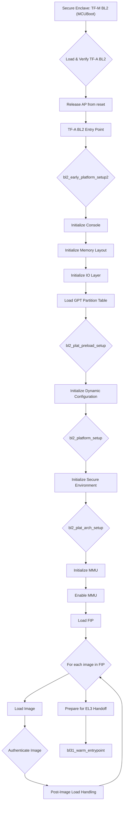

# TF-A BL2 Technical Report: Corstone-1000 FVP

## 1. Executive Summary & High-Level Role

The Trusted Firmware-A (TF-A) BL2 boot stage plays a critical role in the secure boot process of the Corstone-1000 platform. It acts as the primary bootloader for the Application Processor (AP), a Cortex-A35, and is responsible for loading and authenticating the subsequent boot stages in the FVP simulation environment.

The BL2 image is loaded into the FVP's memory by the Secure Enclave's bootloader (TF-M BL2, which is MCUBoot). The Secure Enclave first verifies the signature of the BL2 image, which is stored in the Firmware Image Package (FIP). Once the signature is verified, the Secure Enclave releases the AP from reset, and the AP begins executing the BL2 image.

BL2's primary responsibilities include:
-   Initializing the platform hardware, including the memory management unit (MMU) and the console.
-   Loading the subsequent bootloader images (BL31, BL32/SP_MIN, and BL33/U-Boot) from the FIP.
-   Authenticating the bootloader images using a chain of trust rooted in the Root of Trust Public Key (ROTPK).
-   Handing off execution to the next boot stage (BL31).

## 2. Execution Flow Diagram

## 3. Detailed Code Trace and Key Function Analysis

The TF-A BL2 execution flow on the Corstone-1000 FVP platform is a combination of generic ARM platform setup and platform-specific customizations. The following is a detailed trace of the key functions involved in the BL2 boot process.

### Platform Initialization

The platform initialization is performed by a series of functions that are called in a specific order. The main entry point for platform-specific setup is `bl2_platform_setup()`, which is defined in `plat/arm/board/corstone1000/common/corstone1000_plat.c`.

1.  **`bl2_platform_setup()`**: This function is the main platform-specific setup function for BL2. It calls `arm_bl2_platform_setup()` to perform generic ARM platform setup, and then calls `set_fip_image_source()` to locate the FIP image in flash.

2.  **`arm_bl2_platform_setup()`**: This function, defined in `plat/arm/common/arm_bl2_setup.c`, performs generic ARM platform initialization. This includes initializing the secure environment and setting up memory protection.

3.  **`bl2_plat_arch_setup()`**: This function, also defined in `plat/arm/common/arm_bl2_setup.c`, performs architecture-specific setup. It initializes the MMU, sets up the page tables, and enables the MMU. It also populates the FCONF framework with information from the configuration device tree.

4.  **`set_fip_image_source()`**: This function, defined in `plat/arm/board/corstone1000/common/corstone1000_plat.c`, is responsible for locating the FIP image in flash. It retrieves the IO policy for the FIP image and adjusts the offset to skip the signature area.

### Image Loading

The subsequent boot stage images (BL31, BL32/SP_MIN, BL33/U-Boot) are loaded from the FIP by the `bl_main()` function in `common/bl_common.c`. `bl_main()` iterates through the images described in the `bl_mem_params_desc_t` structures and loads them one by one.

The `bl_mem_params_desc_t` structures for the Corstone-1000 platform are defined in `plat/arm/board/corstone1000/common/corstone1000_bl2_mem_params_desc.c`. This file defines the memory layout for the bootloader images and specifies the order in which they should be loaded.

### Chain of Trust Verification

The chain of trust verification is performed by the `load_auth_image()` function in `common/tbbr/tbbr_img_load.c`. This function is called by `bl_main()` to load and authenticate each image.

The `load_auth_image()` function performs the following steps:
1.  Loads the image from the FIP.
2.  Authenticates the image using the ROTPK. The `plat_get_rotpk_info()` function is called to retrieve the ROTPK hash from the FIP.
3.  If the image is authentic, it is copied to its final destination in memory.

The platform-specific implementation of the trusted boot functions is provided in `plat/arm/board/corstone1000/common/corstone1000_trusted_boot.c`. This file provides the `plat_get_rotpk_info()` function, which retrieves the ROTPK from the FCONF framework.

### Execution Handoff

After all the images have been loaded and authenticated, `bl_main()` calls `bl2_prepare_next_image()` to prepare for the handoff to the next boot stage. This function retrieves the entry point information for the next image (BL31) and prepares the system for the handoff.

Finally, `bl_main()` calls `el3_exit()` to exit from BL2 and jump to the entry point of the next image.

## 4. Key Data Structures and Security Mechanisms

### Data Structures

The following are the key data structures used by BL2 to manage and load firmware images:

*   **`fip.h`**: This header file defines the structure of the Firmware Image Package (FIP). The FIP is a container format that is used to package the bootloader images and other payloads into a single archive.
*   **`fip_toc_header_t` and `fip_toc_entry_t`**: These structures define the table of contents (TOC) of the FIP. The TOC contains a list of all the images in the FIP, along with their UUIDs and offsets.
*   **`bl_mem_params_desc_t`**: This structure, defined in `common/bl_common.h`, is used to describe the memory layout for each bootloader image. It contains the image ID, the entry point information, and the image information.
*   **`image_info_t`**: This structure, also defined in `common/bl_common.h`, contains information about the image, such as its source, size, and destination in memory.
*   **`entry_point_info_t`**: This structure, also defined in `common/bl_common.h`, contains the entry point information for the image, including the entry point address and the SPSR.

### Security Hardening

BL2 contributes to the system's security posture in the following ways:

*   **Chain of Trust:** BL2 is a critical component of the chain of trust. It is responsible for authenticating the subsequent bootloader images, ensuring that only authorized code is executed on the device.
*   **Memory Protection:** BL2 initializes the MMU and sets up the page tables to protect the memory from unauthorized access. This helps to prevent malicious code from accessing sensitive data or corrupting the system.
*   **Secure Environment:** BL2 initializes the secure environment, which is used to run trusted applications and services. This helps to isolate sensitive data and code from the non-secure world.

## 5. Platform Integration and Tooling

### Platform-Specific Code

The platform-specific logic for the Corstone-1000 platform is located in the `plat/arm/board/corstone1000` directory within the TF-A source tree. The key source files include:

*   `corstone1000_plat.c`: Contains the main platform-specific setup functions for BL2.
*   `corstone1000_bl2_mem_params_desc.c`: Defines the memory layout for the bootloader images.
*   `corstone1000_trusted_boot.c`: Implements the platform-specific trusted boot functions.
*   `platform_def.h`: Contains platform-specific definitions, such as memory addresses and image sizes.

### Associated Tooling

The `fiptool` is a command-line tool that is used to create and manage Firmware Image Packages (FIPs). The FIP is a container format that is used to package the bootloader images and other payloads into a single archive.

The `fiptool` can be used to:
*   Create a new FIP.
*   Add images to an existing FIP.
*   Remove images from an existing FIP.
*   Print the contents of a FIP.
