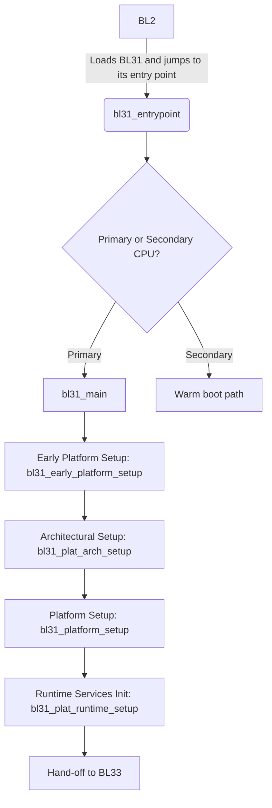
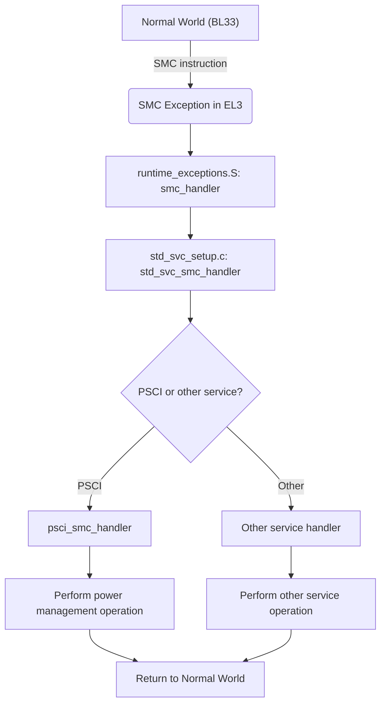

# Technical Report: TF-A BL31 Boot Stage on Corstone-1000 FVP

## 1. Executive Summary

This report provides a comprehensive technical analysis of the Trusted Firmware-A (TF-A) BL31 boot stage for the Corstone-1000 FVP platform. BL31, also known as the EL3 Runtime Software, is the core of the TF-A, acting as a Secure Monitor that runs in the highest exception level (EL3). Its primary role is to initialize the secure world, provide a set of runtime services to the normal world, and manage the secure transition between the two.

The BL31 stage is loaded and started by the BL2 bootloader. Once running, it performs a series of platform and architectural initializations, including setting up the exception vectors, initializing the memory management unit (MMU), and configuring the Generic Interrupt Controller (GIC). After the initialization is complete, BL31 is responsible for handing off control to the normal-world bootloader (BL33), such as U-Boot.

During runtime, BL31 acts as a Secure Monitor, handling Secure Monitor Calls (SMCs) from the normal world. These SMCs are used to access the runtime services provided by BL31, such as the Power State Coordination Interface (PSCI), which is used for power management operations like CPU hotplug, idle, and suspend.

This report will provide a detailed code trace of the BL31 initialization flow, an analysis of the key data structures and functions, an overview of the platform-specific implementation for the Corstone-1000, and a discussion of the security mechanisms in place.

## 2. BL31 Initialization and Runtime Flowcharts

### 2.1. BL31 Initialization Flow

### 2.2. Runtime SMC Handling Flow

## 3. Detailed Code Trace and Key Function Analysis

The BL31 initialization process is a sequence of function calls that set up the secure environment. The following is a step-by-step code trace of the initialization flow, along with an analysis of the key functions.

### 3.1. Code Trace

1.  **`bl31_entrypoint`**: This is the first function to be executed in BL31. It is responsible for distinguishing between a cold boot and a warm boot and for calling the appropriate initialization function. On a cold boot, it calls `bl31_main`.

2.  **`bl31_main`**: This function orchestrates the entire BL31 initialization process. It calls the following functions in sequence:
    *   `bl31_early_platform_setup()`: Performs early platform-specific initialization.
    *   `bl31_plat_arch_setup()`: Performs architectural initialization.
    *   `bl31_platform_setup()`: Performs the main platform-specific initialization.
    *   `bl31_plat_runtime_setup()`: Initializes the runtime services.
    *   `bl31_prepare_next_image_entry()`: Prepares for the hand-off to the normal world.
    *   `el3_exit()`: Transitions to the normal world.

### 3.2. Key Function Analysis

*   **`bl31_platform_setup()`**: This function is responsible for the main platform-specific initialization. For the Corstone-1000 platform, this function performs the following key initializations:
    *   **GIC Initialization:** It calls `plat_arm_gic_driver_init()` to initialize the GIC-600 driver. The GIC is configured with the appropriate interrupt properties for the platform.
    *   **Power Management Initialization:** It calls `plat_arm_pwrc_setup()` to initialize the power controller.
    *   **TrustZone Configuration:** It configures the TrustZone controller to create a secure region in DRAM for the secure world.

*   **`smc_handler`**: This function is the main entry point for handling SMCs. It is implemented in assembly in `bl31/aarch64/runtime_exceptions.S`. It saves the context of the normal world, switches to the secure world, and calls the C-level SMC dispatcher, `std_svc_smc_handler`.

*   **Context Management:** The context management is handled by the functions in `lib/el3_runtime/aarch64/context.c`. The `cm_init()` function initializes the context management library, and the `cm_get_context()` and `cm_set_context()` functions are used to get and set the context of a specific security state.

## 4. Key Data Structures

*   **`cpu_context_t`**: This structure, defined in `include/lib/el3_runtime/aarch64/context.h`, holds the context of a CPU for a specific security state. It includes the general-purpose registers, the program counter, and the processor state register.

*   **`entry_point_info_t`**: This structure, defined in `include/bl_common.h`, holds the information required to start the execution of the next boot stage. It includes the entry point address, the SPSR, and the arguments to be passed to the next stage.

## 5. Platform-Specific Implementation on Corstone-1000 FVP

The Corstone-1000 FVP platform has a number of platform-specific implementations in the TF-A, which are located in the `plat/arm/board/corstone1000` directory. The key platform-specific files are:

*   `corstone1000_plat.c`: This file contains the main platform-specific initialization functions, such as `bl31_early_platform_setup()`, `bl31_platform_setup()`, and `bl31_plat_runtime_setup()`. In `bl31_platform_setup`, the GIC-600 is initialized and the TrustZone controller is configured.
*   `corstone1000_pm.c`: This file contains the platform-specific power management functions, which are used by the PSCI framework. It implements the hooks for the PSCI `cpu_on`, `cpu_off`, and `cpu_suspend` calls.
*   `corstone1000_topology.c`: This file defines the power domain topology of the Corstone-1000 platform, which is used by the PSCI framework to manage the power states of the CPUs and clusters.

## 6. FIP Tooling

The Firmware Image Package (FIP) is a single binary file that contains all the firmware images for the platform. The FIP is created using the `fiptool` command-line tool, which is located in the `tools/fiptool` directory.

The `fiptool` can be used to create, update, and unpack FIPs. The FIP layout consists of a table of contents (ToC) followed by the payload data. The ToC contains a list of all the images in the FIP, along with their UUID, offset, and size.

For the Corstone-1000 platform, the FIP contains the following images, as defined in `plat/arm/board/corstone1000/tbbr_cot_corstone1000.mk`:

*   BL2
*   BL31
*   BL33 (U-Boot)

The FIP is loaded by the BL1 stage from the platform storage (e.g., flash memory) and is used to load the subsequent boot stages.

## 7. Conclusion

The TF-A BL31 boot stage is a complex and critical component of the Arm Trusted Firmware. This report has provided a detailed technical overview of the BL31 boot stage for the Corstone-1000 FVP platform, including the initialization flow, the platform-specific implementation, the runtime services, the security mechanisms, and the FIP tooling.

The Corstone-1000 platform provides a good example of how to configure and extend the TF-A for a specific platform. The platform-specific code is well-structured and easy to understand, and the use of the FIP tooling simplifies the process of creating and managing the firmware images.
