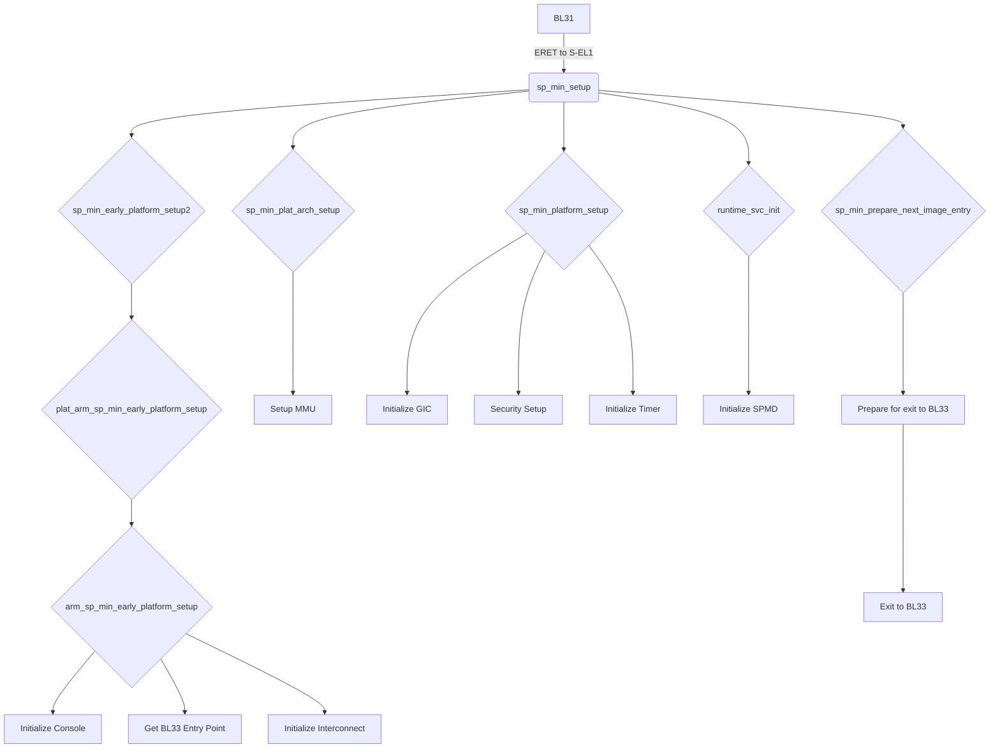
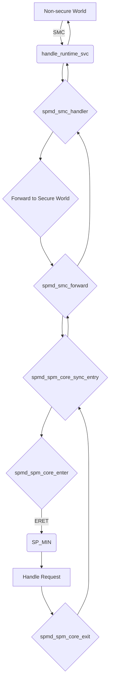

# Technical Report: TF-A BL32 (SP_MIN) on Corstone-1000 FVP

## 1. Executive Summary & High-Level Role

The Trusted Firmware-A (TF-A) BL32 stage, when implemented as `SP_MIN`, serves as the initial Secure Partition Manager (SPM) in the Armv8-A architecture. On the Corstone-1000 FVP platform, its primary role is to create a minimal secure environment capable of hosting and managing Secure Partitions (SPs), such as OP-TEE, which in turn acts as a full-featured Secure OS.

`SP_MIN` is not a standalone Secure OS itself. Instead, it acts as a lightweight manager responsible for:

*   **Initializing the Secure World:** It sets up the necessary hardware, such as the GIC and MMU, to create a secure execution environment.
*   **Loading and Managing Secure Partitions:** It loads the initial Secure Partition (in this case, OP-TEE) into memory and prepares it for execution.
*   **Mediating Communication:** It acts as a gatekeeper for communication between the Non-secure and Secure worlds, forwarding requests from the Non-secure world to the appropriate Secure Partition and returning the results.

### 1.1. Code Loading and Execution Transfer

The loading and execution of `SP_MIN` follows the standard TF-A boot flow:

1.  **BL2 (Boot Loader Stage 2):** BL2 is responsible for loading the subsequent boot stages from a Firmware Image Package (FIP). It reads the FIP from flash memory, finds the BL32 image (which is `SP_MIN` in this case), and copies it to its designated location in SRAM. BL2 also loads the BL33 image (the Non-secure world bootloader, e.g., U-Boot) and passes its entry point information to BL31.

2.  **BL31 (EL3 Runtime Software):** After BL2 has loaded all the necessary images, it transfers control to BL31. BL31 is the EL3 runtime software and is responsible for managing the system's security state. It initializes its own runtime services, including the Secure Partition Manager Dispatcher (SPMD), and then transfers control to BL32 (`SP_MIN`).

3.  **BL32 (`SP_MIN`):** BL31 passes control to `SP_MIN` by performing an `ERET` to S-EL1. `SP_MIN` then performs its own initialization, including setting up the Secure World and preparing for the execution of the initial Secure Partition (OP-TEE). Once this is complete, `SP_MIN` exits to BL33, allowing the Non-secure world to boot.

This process ensures that the Secure World is fully initialized and ready to handle requests before the Non-secure world is allowed to boot.

## 2. Execution Flow Diagram

### 2.1. Initialization Flowchart

### 2.2. Runtime Flowchart

## 3. Detailed Code Trace and Key Function Analysis

This section provides a detailed code trace of BL32's main logic and an analysis of the key functions involved in its operation.

### 3.1. Initialization (`sp_min_init`)

The initialization of `SP_MIN` begins with the `sp_min_setup` function, which is called by BL31. This function, in turn, calls a series of platform-specific and generic initialization functions.

1.  **`sp_min_setup()`** (`bl32/sp_min/sp_min_main.c`): This is the main C entry point for `SP_MIN`. It calls `sp_min_early_platform_setup2()`.

2.  **`sp_min_early_platform_setup2()`** (`plat/arm/common/sp_min/arm_sp_min_setup.c`): This function is a weak symbol that can be overridden by a platform-specific implementation. For `corstone1000`, it calls `plat_arm_sp_min_early_platform_setup()`.

3.  **`plat_arm_sp_min_early_platform_setup()`** (`plat/arm/common/sp_min/arm_sp_min_setup.c`): This function calls `arm_sp_min_early_platform_setup()`.

4.  **`arm_sp_min_early_platform_setup()`** (`plat/arm/common/sp_min/arm_sp_min_setup.c`): This function performs the following actions:
    *   Initializes the console using `arm_console_boot_init()`.
    *   Retrieves the entry point information for BL33 (the non-secure world) from the parameters passed by BL2.
    *   Initializes the interconnect using `plat_arm_interconnect_init()`.
    *   Enters interconnect coherency using `plat_arm_interconnect_enter_coherency()`.

5.  **`sp_min_plat_arch_setup()`** (`plat/arm/common/sp_min/arm_sp_min_setup.c`): This function sets up the MMU for BL32 using `setup_page_tables()` and `enable_mmu_svc_mon()`.

6.  **`sp_min_platform_setup()`** (`plat/arm/common/sp_min/arm_sp_min_setup.c`): This function performs the following actions:
    *   Initializes the GIC using `plat_arm_gic_driver_init()` and `plat_arm_gic_init()`.
    *   Performs security setup using `plat_arm_security_setup()`.
    *   Initializes the system timer.

7.  **`runtime_svc_init()`** (`common/runtime_svc.c`): This function initializes the runtime service framework. It discovers the runtime services (including the SPMD) and calls their `init` functions.

8.  **`sp_min_prepare_next_image_entry()`** (`bl32/sp_min/sp_min_main.c`): This function prepares for the exit to the non-secure world. It gets the entry point information for BL33 and calls `psci_prepare_next_non_secure_ctx()` to set up the non-secure context.

### 3.2. Request Handling

Requests from the non-secure world are handled by the SPMD, which then forwards them to the SPMC (`SP_MIN`).

1.  **SMC from Non-secure World:** A driver in the non-secure world makes an SMC call.

2.  **`handle_runtime_svc()`** (`common/runtime_svc.c`): The SMC is trapped to EL3 and handled by this function. It identifies the SMC as an FFA service and calls `spmd_smc_handler()`.

3.  **`spmd_smc_handler()`** (`services/std_svc/spmd/spmd_main.c`): This function is the main SMC handler for the SPMD. It determines that the call is from the non-secure world and needs to be forwarded to the secure world.

4.  **`spmd_smc_forward()`** (`services/std_svc/spmd/spmd_main.c`): This function saves the non-secure context, restores the secure context, and calls `spmd_spm_core_sync_entry()`.

5.  **`spmd_spm_core_sync_entry()`** (`services/std_svc/spmd/spmd_main.c`): This function sets up the SPMC context and calls `spmd_spm_core_enter()`.

6.  **`spmd_spm_core_enter()`** (`services/std_svc/spmd/aarch64/spmd_helpers.S`): This function saves the SPMD's context and performs an `ERET` to the SPMC (`SP_MIN`).

### 3.3. Secure Partition Management

`SP_MIN` itself does not provide a full-featured scheduler for Secure Partitions. Instead, it is designed to host a single Secure Partition, which is expected to be a full-featured Secure OS like OP-TEE.

`SP_MIN`'s role in Secure Partition management is limited to:

*   **Loading the initial SP:** It loads the initial SP (OP-TEE) from the FIP and prepares it for execution.
*   **Passing control to the SP:** It passes control to the SP by performing an `ERET` to S-EL1.
*   **Mediating communication:** It acts as a bridge between the SP and the non-secure world, forwarding requests and results.

The actual scheduling and management of Secure Partitions is handled by the Secure OS (OP-TEE) running as the initial SP.

### 3.4. Communication with BL31

Communication between `SP_MIN` and BL31 is handled by the SPMD.

*   **From `SP_MIN` to BL31:** When `SP_MIN` needs to communicate with BL31 (e.g., to return the result of a request), it calls a function that eventually leads to `spmd_spm_core_exit()`. This function restores the SPMD's context and returns to the SPMD.

*   **From BL31 to `SP_MIN`:** When BL31 needs to communicate with `SP_MIN` (e.g., to forward a request from the non-secure world), it calls `spmd_smc_handler()`, which in turn calls `spmd_smc_forward()` to enter `SP_MIN`.

The `spmd_smc_handler` is the key function that mediates all communication between the secure and non-secure worlds. It ensures that all requests and results are passed through the SPMD, which can then enforce security policies and manage the system's security state.

## 4. Key Data Structures and Security Mechanisms

### 4.1. Key Data Structures

`SP_MIN` and the SPMD use several key data structures to manage the system's state and facilitate communication between the secure and non-secure worlds.

*   **`spmd_spm_core_context_t`** (`services/std_svc/spmd/spmd_private.h`): This structure holds the context for a single core in the SPM. It includes the CPU context (`cpu_context_t`), the C runtime context (`c_rt_ctx`), and the state of the SPMC (`spmc_state_t`).

*   **`smc_ctx_t`** (`bl32/sp_min/sp_min_main.c`): This structure holds the SMC context for a single core. It is used to save and restore the state of the non-secure world when an SMC is handled.

*   **`rt_svc_desc_t`** (`include/common/runtime_svc.h`): This structure describes a runtime service. It includes the name of the service, the Owning Entity Number (OEN) range, the call type (fast or yielding), and pointers to the `init` and `handle` functions.

*   **`fip_toc_header_t`** and **`fip_toc_entry_t`** (`include/tools_share/firmware_image_package.h`): These structures define the format of the Firmware Image Package (FIP). The `fip_toc_header_t` contains the header information for the FIP, while the `fip_toc_entry_t` describes a single image within the FIP.

### 4.2. Security Mechanisms

`SP_MIN` and the SPMD implement several security mechanisms to enforce isolation between the secure and non-secure worlds and between different Secure Partitions.

*   **EL3 as a gatekeeper:** All communication between the secure and non-secure worlds is mediated by the SPMD running at EL3. This ensures that the non-secure world cannot directly access the secure world, and that all requests are properly sanitized and validated.

*   **MMU-based memory isolation:** `SP_MIN` sets up the MMU to create separate virtual address spaces for the secure and non-secure worlds. This prevents the non-secure world from accessing secure memory, and vice-versa.

*   **Secure Interrupts:** Secure interrupts are handled by the SPMD, which then forwards them to the SPMC for handling. This ensures that secure interrupts are not handled by the non-secure world, and that the system remains in a secure state.

*   **Firmware Image Package (FIP):** The use of a FIP ensures that the bootloader and firmware images are loaded from a trusted source and have not been tampered with. The FIP is signed and verified by the bootloader before being used.

## 5. Platform Integration and Tooling

### 5.1. Platform-Specific Code

The platform-specific logic for Corstone-1000's BL32 (`SP_MIN`) implementation is contained in the following key source files:

*   **`plat/arm/board/corstone1000/common/corstone1000_plat.c`**: This file contains the main platform setup functions for BL2, which is responsible for loading BL32.
*   **`plat/arm/common/sp_min/arm_sp_min_setup.c`**: This file contains the generic `SP_MIN` platform setup functions that are used by `corstone1000`.
*   **`plat/arm/board/corstone1000/common/corstone1000_topology.c`**: This file describes the topology of the Corstone-1000 platform, including the number of cores and clusters.
*   **`plat/arm/board/corstone1000/common/corstone1000_bl2_mem_params_desc.c`**: This file defines the memory layout for BL2.
*   **`plat/arm/board/corstone1000/common/corstone1000_trusted_boot.c`**: This file contains functions related to trusted boot.
*   **`plat/arm/board/corstone1000/common/corstone1000_pm.c`**: This file contains the platform-specific power management functions.
*   **`plat/arm/board/corstone1000/common/corstone1000_security.c`**: This file contains the platform-specific security setup functions.

### 5.2. Associated Tooling

The `fiptool` is used to create and manage the Firmware Image Package (FIP), which contains the BL32 (`SP_MIN`) image. The FIP is a single binary file that contains all the firmware images required to boot the system.

The `fiptool` can be used to:

*   **Create a new FIP:** The `fiptool create` command can be used to create a new FIP from a set of individual firmware images.
*   **Update an existing FIP:** The `fiptool update` command can be used to add, remove, or replace images in an existing FIP.
*   **Unpack a FIP:** The `fiptool unpack` command can be used to extract the individual firmware images from a FIP.

The FIP is typically created by the build system as part of the firmware build process. The build system uses `fiptool` to package the BL2, BL31, BL32, and BL33 images into a single FIP, which is then written to flash memory.
