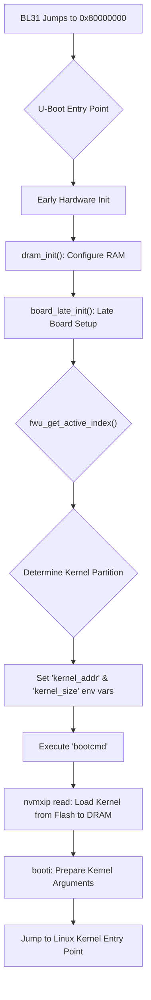

# Technical Report: TF-A BL33 Execution on Corstone-1000 FVP

## 1. Executive Summary & High-Level Role

The Trusted Firmware-A (TF-A) BL33 stage for the Arm Corstone-1000 platform is the **Non-secure world bootloader**. In this architecture, BL33 is typically **U-Boot**. Its primary role is to initialize the Non-secure hardware required for a Rich Execution Environment (REE), load the final Non-secure OS (e.g., Linux), and hand over execution control to it.

BL33 operates in the Non-secure world at Exception Level 2 (EL2), functioning as the final link in the secure boot chain before the operating system takes control.

### Image Loading and Execution Handoff

1.  **FIP Loading (BL2):** The boot process begins with the platform's boot ROM loading the second-stage bootloader, **BL2**, into SRAM. BL2 is responsible for parsing the **Firmware Image Package (FIP)**, a single binary file containing multiple boot-stage images. For the Corstone-1000, BL2 reads the FIP from NOR flash.

2.  **Image Staging (BL2):** BL2 locates and loads the subsequent boot images from the FIP into their designated memory locations. This includes:
    *   **BL31 (EL3 Runtime Firmware):** Loaded into a secure region of SRAM.
    *   **BL32 (Secure Payload, OP-TEE):** Loaded into a separate secure region of SRAM.
    *   **BL33 (U-Boot):** Loaded into the beginning of Non-secure DRAM at address `0x80000000`.

3.  **Execution Transfer (BL31):** After loading the images, BL2 passes control to **BL31**. BL31 performs final secure-world initializations. To determine the next execution stage, BL31 does not use a hardcoded address but instead consults a `bl_mem_params_node_t` data structure passed by BL2. This structure, defined in `corstone1000_bl2_mem_params_desc.c`, provides the entry point and processor state for BL33.

    The key parameters for BL33 are:
    *   **Entry Point (`ep_info.pc`):** `0x80000000` (defined as `BL33_BASE` in `platform_def.h`).
    *   **Processor State (`ep_info.spsr`):** Configured for entry into `MODE_EL2` (Non-secure Hypervisor mode).

    BL31 then performs a world switch from Secure to Non-secure and jumps to the `BL33_BASE` address, initiating the U-Boot execution flow.

## 2. Execution Flow Diagram

The following Mermaid diagram illustrates the main execution path of U-Boot (BL33) on the Corstone-1000 FVP.



## 3. Detailed Code Trace and Key Function Analysis

The U-Boot execution flow for Corstone-1000 is a combination of generic ARMv8 start-up code and platform-specific routines.

### Initialization

Upon receiving control from BL31 at `0x80000000`, U-Boot begins its initialization sequence.

1.  **Low-Level Assembly Init:** The very first code to run is in `arch/arm/cpu/armv8/start.S`. This assembly code sets up the initial C runtime environment, including the stack pointer, and invalidates the instruction and data caches.

2.  **`board_init_f()` Sequence:** Control is then transferred to the C function `board_init_f()`. This function orchestrates a series of initializations running from flash/SRAM before DRAM is fully available. For Corstone-1000, most of these functions are stubs or use common implementations. A key platform-specific function called in this phase is:
    *   **`dram_init()`** (in `board/armltd/corstone1000/corstone1000.c`): This function sets up the global data structure (`gd`) with the size of the system's DRAM (`PHYS_SDRAM_1_SIZE`).

3.  **Relocation and `board_init_r()`:** After the `board_init_f` sequence, U-Boot relocates itself to the top of DRAM and transfers control to `board_init_r()`. This function runs from DRAM and completes the hardware setup. A critical function called here is:
    *   **`board_late_init()`** (in `board/armltd/corstone1000/corstone1000.c`): This function contains the core logic for preparing the boot environment. It performs the following actions:
        *   Initializes VirtIO devices if running on the FVP.
        *   Probes the NVMXIP (NOR flash) device to access the partition table.
        *   Calls `fwu_get_active_index()` to determine whether to boot from the primary or secondary OS partition (part of the A/B update mechanism).
        *   Sets the `kernel_addr` and `kernel_size` environment variables based on the active partition's location in flash.

### OS Kernel Loading

U-Boot does not have a hardcoded boot sequence. Instead, it executes a command stored in the **`bootcmd`** environment variable. For Corstone-1000, `board_late_init` sets up the necessary variables, but the `bootcmd` itself performs the loading. A typical `bootcmd` for this platform would be:

```bash
"nvmxip read ${loadaddr} ${kernel_addr} ${kernel_size}; booti ${loadaddr} - ${fdt_addr}"
```

The functions involved are:

1.  **`nvmxip read`**: This command reads the kernel image from the NOR flash.
    *   **`dev_get_uclass_plat()`**: Gets the platform data for the NVMXIP device.
    *   **`blk_dread()`**: The underlying block device read function that copies the data from the offset specified by `${kernel_addr}` into DRAM at `${loadaddr}`.

2.  **`booti`**: This command is responsible for booting an ARM64 kernel. It is implemented by the `do_booti()` function in `cmd/bootm.c`.

### Information Passing

The primary mechanism for passing information from the bootloader to the Linux kernel is the **Device Tree Blob (DTB)**.

*   **Initial DTB:** U-Boot loads a base DTB from a predefined location in flash or receives it from the secure world.
*   **Modification:** U-Boot modifies the DTB in memory before passing it to the kernel. Common modifications include:
    *   Adding a `/chosen` node with a `bootargs` property containing the kernel command line.
    *   Adding memory map information.
    *   Enabling or disabling nodes based on detected hardware.
*   The final, modified DTB address is stored in the `fdt_addr` environment variable.

### Execution Handoff

The final jump to the OS is handled by the `booti` command's implementation (`do_booti`).

1.  **`do_booti()`** (in `cmd/bootm.c`): This function orchestrates the final steps.
    *   It takes the kernel image address (`${loadaddr}`) and the DTB address (`${fdt_addr}`) as arguments.
    *   It calls `boot_get_kernel()` to process the kernel image header and determine the entry point.
    *   It calls `boot_jump_linux()`, which prepares the CPU state for the kernel.

2.  **`boot_jump_linux()`** (in `arch/arm/lib/bootm.c`): This function performs the final handoff.
    *   It disables interrupts and the MMU.
    *   It places the physical address of the device tree blob (DTB) into register `x0`. This is the standard ARM64 calling convention for passing the DTB to the kernel.
    *   It jumps to the kernel entry point address, which was previously read from the kernel image header.

## 4. Key Data Structures and Interaction with Secure World

### Data Structures

*   **Device Tree Blob (DTB):** A hierarchical data structure that describes the hardware present in the system. It is the primary means of passing hardware configuration from the bootloader to the kernel, eliminating the need for hardcoded platform details in the kernel source.
*   **Boot Arguments (`bootargs`):** A string inside the `/chosen` node of the DTB that contains the kernel command line. U-Boot constructs this string with parameters like the root filesystem location and console configuration.

### SMC Interaction

While U-Boot itself rarely makes Secure Monitor Calls (SMCs), it operates in a system where the Non-secure OS relies on the Secure Monitor (BL31) for runtime services.

*   **SMC Instruction:** An application or OS in the Non-secure world executes the `smc` instruction to trap into the Secure Monitor at EL3.
*   **PSCI (Power State Coordination Interface):** This is the most common service requested via SMC. The Linux kernel uses PSCI to request power management operations like CPU hotplug, suspend, and system shutdown, which can only be coordinated by the secure world.
*   **Other Services:** The Secure Monitor can also provide other secure services, such as access to a hardware random number generator or other trusted functions.

## 5. Platform Integration and Tooling

### Platform-Specific Code

*   **TF-A:** `plat/arm/board/corstone1000/` contains the platform-specific setup, including memory maps and boot parameter descriptors.
*   **U-Boot:** `board/armltd/corstone1000/` contains the board-specific C code (`corstone1000.c`) and environment definitions (`corstone1000.env`). The device tree source is typically located at `arch/arm/dts/corstone1000.dts`.

### Associated Tooling

The **`fiptool`** utility is critical for creating the Firmware Image Package (`fip.bin`). The process is managed by the Yocto build system:

1.  **Recipe Definition:** The `trusted-firmware-a_%.bbappend` recipe in `meta-arm-bsp` includes `trusted-firmware-a-corstone1000.inc`.
2.  **Build Configuration:** This include file sets the `TFA_BUILD_TARGET` to `"bl2 bl31 fip"`. It also defines the paths to other required binaries, such as `BL32` (OP-TEE). The path to `BL33` (U-Boot) is passed in by the build environment.
3.  **`fiptool` Invocation:** The TF-A makefile contains a rule for the `fip` target. This rule invokes `fiptool` with a `create` command, followed by arguments specifying each binary to be included in the package (e.g., `--bl2 bl2.bin`, `--bl33 u-boot.bin`).
4.  **Packaging:** `fiptool` assembles these binaries into a single `fip.bin` file. Each image is packaged with a UUID and other metadata, allowing BL2 to locate and load them correctly at boot time.
