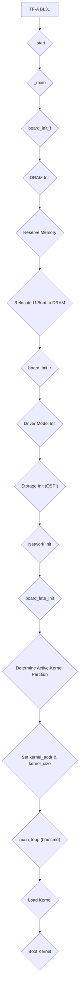

# U-Boot (BL33) Boot Stage Analysis for Corstone1000 FVP

## 1. Executive Summary & High-Level Role

U-Boot, in its role as BL33, is the final bootloader stage before the operating system kernel. It is loaded and executed by the Trusted Firmware-A (TF-A) BL31 stage. Its primary responsibilities are to perform the final hardware initialization, provide a console for user interaction, and load and execute the Linux kernel. For the Corstone-1000 FVP platform, U-Boot is configured to run from the QSPI flash and load the kernel from either a primary or secondary partition on the same flash device.

## 2. Execution Flow Diagram

## 3. Detailed Code Trace and Key Function Analysis

### `_main`

*   **File:** `arch/arm/lib/crt0_64.S`
*   **Purpose:** This is the low-level assembly entry point for U-Boot. It is responsible for setting up the initial C runtime environment, including a temporary stack, and then calling the first C-level board initialization function (`board_init_f`).
*   **Key Logic Walkthrough:**
    1.  **Stack Setup:** It sets up a temporary stack pointer (`sp`) in a memory region that is guaranteed to be available (e.g., on-chip SRAM).
    2.  **Global Data Pointer:** It initializes the global data pointer (`gd`), which is stored in a dedicated register (`x18` on AArch64), to point to the top of the temporary stack.
    3.  **Call `board_init_f`:** It makes the first call to C code, jumping to the `board_init_f` function.
    4.  **Relocation Setup:** After `board_init_f` returns, it retrieves the new stack pointer and global data pointer (which are now in DRAM) from the `gd` structure.
    5.  **Relocate Code:** It calls `relocate_code` to copy the U-Boot image from its initial location in flash to its final destination in DRAM.
    6.  **Clear BSS:** It clears the BSS section in DRAM to ensure all uninitialized global variables are zeroed.
    7.  **Call `board_init_r`:** It calls the second main C-level initialization function, `board_init_r`, which will not return.
*   **Important Parameters & Return Values:**
    *   This function is the absolute entry point from the previous boot stage (BL31). It does not receive parameters in the traditional sense.
    *   It does not return.

### `board_init_f()`

*   **File:** `common/board_f.c`
*   **Purpose:** This is the first C-level initialization function. It is responsible for performing the minimal hardware setup required to get the system into a state where U-Boot can be relocated to DRAM.
*   **Key Logic Walkthrough:**
    *   It executes a sequence of initialization functions defined in the `init_sequence_f` array. For `corstone1000`, the most important of these are:
        1.  **`dram_init()`:** This function configures the DRAM controller and determines the size of the available RAM. For `corstone1000`, this is a simple function that sets the RAM size to a predefined value.
        2.  **`reserve_*` functions:** A series of functions that reserve memory at the top of DRAM for various U-Boot components, including the U-Boot code itself, the malloc heap, the FDT, and the global data structure.
        3.  **`setup_reloc()`:** This function calculates the relocation offset (the difference between the linked address of U-Boot and its final location in DRAM) and copies the global data structure to its final location.
*   **Important Parameters & Return Values:**
    *   `boot_flags`: A bitmask of flags passed from the entry point.
    *   This function does not return in the conventional sense. It sets up the system for `relocate_code` to be called.

### `board_init_r()`

*   **File:** `common/board_r.c`
*   **Purpose:** This is the second C-level initialization function. It is called after U-Boot has been relocated to DRAM and has a proper C runtime environment (including a stack and BSS). It is responsible for initializing the rest of the hardware and software subsystems.
*   **Key Logic Walkthrough:**
    *   It executes a sequence of initialization functions from the `init_sequence_r` array. For `corstone1000`, the most important of these are:
        1.  **`initr_dm()`:** Initializes the U-Boot driver model. This is where most of the device drivers are probed and initialized based on the device tree.
        2.  **`initr_mmc()`, `initr_nand()`, etc.:** Initializes the storage devices. For `corstone1000`, the QSPI flash is initialized via the NVMXIP driver, which is probed during `initr_dm()`.
        3.  **`initr_net()`:** Initializes the network stack.
        4.  **`board_late_init()`:** This `corstone1000`-specific function is called. It probes for VirtIO devices, determines the active kernel partition by reading the FWU metadata, and sets the `kernel_addr` and `kernel_size` environment variables.
        5.  **`run_main_loop()`:** Enters the main U-Boot command loop. This loop either waits for user input on the console or automatically executes the `bootcmd` environment variable to load and boot the kernel.
*   **Important Parameters & Return Values:**
    *   `new_gd`: A pointer to the new global data structure in DRAM.
    *   `dest_addr`: The destination address of the U-Boot image in DRAM.
    *   This function does not return.

## 4. Key Data Structures and Interaction with Secure World

### `gd_t` (Global Data)

*   **File:** `include/asm-generic/global_data.h`
*   **Purpose:** This is the central data structure in U-Boot. It holds all the global state of the bootloader, including information about the board, memory map, environment variables, and driver model. It is initialized in `crt0_64.S` and is passed to most of the major U-Boot functions.

### Interaction with the Secure World

*   **PSCI (Power State Coordination Interface):** U-Boot uses the standard PSCI interface to communicate with the Secure World (TF-A) for power management tasks. The `psci` node in the device tree specifies that the `smc` instruction should be used for this communication. The generic PSCI driver in `drivers/firmware/psci.c` handles the details of making the SMC calls.
*   **Firmware Update (FWU):** The interaction for firmware update is indirect. U-Boot reads the FWU metadata from a GPT partition on the QSPI flash to determine the active boot bank. This metadata is written by the Secure Enclave (TF-A), but U-Boot itself does not make any SMC calls to retrieve it.

## 5. Platform Integration and Tooling

### `corstone1000_defconfig`

*   **File:** `configs/corstone1000_defconfig`
*   **Purpose:** This is the main build-time configuration file for U-Boot on the `corstone1000` platform. It enables the necessary drivers and features, and sets key configuration options like the `bootcmd`.

### Device Tree

*   **Files:** `arch/arm/dts/corstone1000.dtsi`, `arch/arm/dts/corstone1000-fvp.dts`
*   **Purpose:** The device tree files describe the hardware of the `corstone1000` FVP platform to U-Boot. They define the memory map, peripherals, and other platform-specific details. The U-Boot driver model uses this information to probe and initialize the various device drivers.
