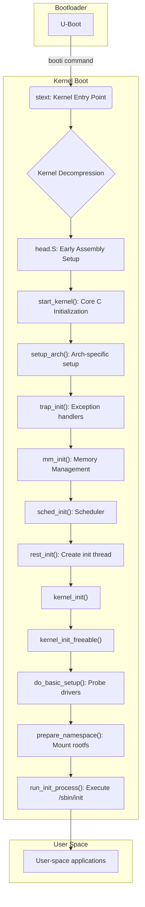

# Technical Report: Linux Kernel Analysis on Corstone-1000 FVP

## 1. Executive Summary & High-Level Role

### 1.1. The Role of the Linux Kernel in the System

The Linux kernel, in the context of the Arm Corstone-1000 FVP, serves as the primary operating system for the **Non-secure Rich Execution Environment (REE)**. The system architecture is partitioned into two distinct security domains: the Secure World, which hosts the Trusted Execution Environment (TEE), and the Non-secure World, which hosts the REE.

The **Secure World**, managed by a chain of trust including TF-A (BL31) and the OP-TEE OS (BL32), is responsible for handling sensitive operations and protecting critical assets. It provides a secure environment for Trusted Applications (TAs).

The **Non-secure World (REE)**, where the Linux kernel operates, provides a feature-rich environment for running general-purpose applications. The kernel's role includes:

- **Hardware Abstraction:** It provides a consistent API for applications to interact with the underlying hardware, abstracting away the complexities of the Corstone-1000 platform.
- **Process Management:** It manages the execution of user-space processes, providing scheduling, memory management, and inter-process communication.
- **Device Management:** Through a driver model integrated with the device tree, it initializes and manages all non-secure peripherals, such as the console, block devices, and network interfaces.
- **System Call Interface:** It exposes a system call interface that allows user-space applications to request services from the kernel.
- **Communication with the Secure World:** The kernel includes drivers (specifically, the OP-TEE driver) that facilitate communication between applications in the Non-secure World and Trusted Applications in the Secure World. This is achieved through the Arm SMC (Secure Monitor Call) Calling Convention.

### 1.2. Kernel Loading and Execution Handoff from U-Boot

The boot process on the Corstone-1000 FVP begins with the platform's boot ROM, which loads and executes a series of secure bootloaders (BL1, BL2) from Trusted Firmware-A (TF-A). These loaders eventually load and execute the OP-TEE OS (BL32) and the U-Boot bootloader (BL33). U-Boot is the final boot stage before the Linux kernel.

The handoff from U-Boot to the Linux kernel follows these steps:

1.  **Loading Kernel and DTB:** U-Boot, running in the Non-secure World, is configured to load the Linux kernel image (typically `Image.gz`, a compressed image) and the Device Tree Blob (`.dtb`) into RAM. The locations for loading these files are often defined in U-Boot's environment variables. The DTB is a critical data structure that describes the hardware layout of the platform to the kernel, allowing for a single kernel image to support multiple hardware configurations.

2.  **Preparing for Kernel Entry:** Before jumping to the kernel, U-Boot sets up the required machine state. For an AArch64 system, this includes:
    - Setting the CPU to the highest implemented exception level for the non-secure state (EL1 for the kernel).
    - Placing the address of the DTB in a specific register, typically `x0`.
    - Disabling interrupts and MMU.

3.  **Transfer of Control:** U-Boot then executes a boot command, such as `booti` (the standard for AArch64), which takes the memory addresses of the kernel image and the DTB as arguments. The `booti` command performs the final preparations and then jumps to the kernel's entry point (`stext`).

This handoff mechanism ensures that the Linux kernel starts its execution with the necessary information about the hardware platform, enabling it to initialize itself and its drivers correctly.

## 2. Execution Flow Diagram

The following flowchart illustrates the high-level execution flow of the Linux kernel boot sequence on the Corstone-1000 FVP, from the entry point to the start of the user-space init process.



## 3. Detailed Code Trace and Key Function Analysis

This section provides a detailed code-level trace of the kernel's boot logic, from the early assembly entry point to the initialization of key subsystems and drivers.

### 3.1. Early Boot (head.S)

The journey begins at the `stext` symbol in `arch/arm64/kernel/head.S`, which is the primary entry point for the kernel. U-Boot transfers control to this point after loading the kernel image and DTB into memory. The key operations performed in this early assembly phase are:

1.  **Preserve Boot Arguments:** The physical address of the Device Tree Blob (DTB), passed in register `x0` by U-Boot, is immediately preserved in register `x21`. This is critical, as the DTB is needed later to discover the hardware layout.

2.  **Early CPU Setup:** The code performs initial, architecture-specific CPU setup. This includes checking for required CPU features and ensuring the CPU is in the correct exception level (EL1) to execute the kernel.

3.  **Kernel Decompression:** The Linux kernel image is often compressed (as `Image.gz`) to save space. If so, the early boot code is responsible for decompressing the kernel into its final location in memory. The `__primary_switch` routine handles this process.

4.  **MMU and Page Table Setup:** The kernel creates a temporary identity-mapped page table (`idmap_pg_dir`) that maps a portion of physical memory directly to virtual memory. This allows the kernel to enable the Memory Management Unit (MMU) and transition from executing at physical addresses to virtual addresses. This is a critical step, as the rest ofthe kernel code expects the MMU to be active.

5.  **Jump to C Code:** After the MMU is enabled, the code performs its final jump from assembly to the main C function, `start_kernel`, located in `init/main.c`. The address of the preserved DTB is passed along to be used in later stages of initialization.

### 3.2. Core Kernel Initialization (start_kernel)

The `start_kernel()` function in `init/main.c` is the main C entry point for the kernel. It is architecture-independent and is responsible for initializing all the core kernel subsystems. Key function calls within `start_kernel()` include:

- **`setup_arch(&command_line)`:** This is one of the most critical early functions. It performs a wide range of architecture-specific initializations, including parsing the kernel command line, discovering available memory from the device tree, and setting up the final kernel page tables. On the Corstone-1000, it will parse the DTB provided by U-Boot to understand the platform's memory layout and hardware components.

- **`trap_init()`:** Initializes the exception and interrupt vector table. This sets up handlers for system calls, faults, and hardware interrupts.

- **`mm_init()`:** Initializes the various memory management subsystems, including the slab allocator, vmalloc, and the buddy allocator. This makes the full range of kernel memory allocation functions available.

- **`sched_init()`:** Initializes the process scheduler. This includes setting up the runqueues for each CPU and preparing the system to manage and schedule tasks.

- **`rest_init()`:** This function is called at the end of `start_kernel()`. It creates the first two kernel threads:
    - **`kernel_init` (PID 1):** This thread is responsible for completing the device driver initialization, mounting the root filesystem, and finally executing the user-space `init` process.
    - **`kthreadd` (PID 2):** This is a kernel daemon that is responsible for creating other kernel threads as needed.

### 3.3. Driver Initialization and Device Tree

The Linux kernel relies on the Device Tree Blob (DTB) to discover and initialize platform-specific drivers. The Corstone-1000 FVP uses the `corstone1000-fvp.dts` file, which includes `corstone1000.dtsi`, to describe its hardware.

The driver initialization process works as follows:

1.  **DTB Parsing:** The `setup_arch()` function calls `unflatten_device_tree()` to parse the DTB passed from U-Boot into an in-memory tree of `device_node` structures.

2.  **Driver Matching:** The kernel's driver model then walks this tree. For each `device_node`, it reads the `compatible` property. This property is a string that uniquely identifies the hardware device. The kernel then searches its list of registered drivers for one that has a matching `compatible` string.

3.  **Probe Function:** When a match is found, the kernel calls the `probe()` function of the corresponding driver. This function is responsible for initializing the device, which typically involves:
    - Mapping the device's registers into memory.
    - Requesting the necessary interrupts.
    - Initializing the device hardware.
    - Registering the device with the appropriate kernel subsystem (e.g., as a TTY device, a block device, or a network interface).

For example, the serial console on the Corstone-1000 is defined in `corstone1000.dtsi` as:

```
uart0: serial@1a510000 {
    compatible = "arm,pl011", "arm,primecell";
    reg = <0x1a510000 0x1000>;
    interrupts = <GIC_SPI 19 IRQ_TYPE_LEVEL_HIGH>;
    ...
};
```

The kernel's `amba-pl011.c` driver registers itself with a matching `compatible` string ("arm,pl011"). When the kernel processes this device tree node, it calls the `pl011_probe()` function, which initializes the UART and registers it as a serial console.

### 3.4. Interaction with Secure World (OP-TEE Driver)

The OP-TEE driver (`drivers/tee/optee/`) is the bridge between the Non-secure REE (Linux) and the Secure World (OP-TEE OS). It allows user-space applications to communicate with Trusted Applications (TAs).

The initialization and operation of the OP-TEE driver are as follows:

1.  **Driver Probing:** The OP-TEE driver is a platform driver that probes for a device with a `compatible` string of `"linaro,optee-tz"`. This node is expected to be present in the device tree. The `optee_probe()` function in `drivers/tee/optee/smc_abi.c` is the entry point for the driver's initialization.

2.  **Capability Exchange:** During probing, the driver communicates with OP-TEE via SMC (Secure Monitor Call) instructions to exchange capabilities. This determines features like whether dynamic shared memory is supported.

3.  **Device Registration:** The driver registers a character device, typically `/dev/tee0`, which acts as the user-space interface to the TEE. It also registers a supplicant device (`/dev/teepriv0`) for the `tee-supplicant` daemon, which handles services like loading TAs.

4.  **User-space Interaction:** A user-space application wanting to communicate with a TA performs the following steps:
    - It opens the `/dev/tee0` device file.
    - It uses `ioctl` calls to open a session with the desired TA.
    - It uses further `ioctl` calls to invoke functions within the TA, passing parameters in shared memory buffers.

5.  **SMC Handling:** When an `ioctl` is issued, the OP-TEE driver constructs a message and triggers an SMC instruction. This causes a trap into the Secure Monitor (TF-A's BL31), which then forwards the request to the OP-TEE OS (BL32). OP-TEE processes the request, potentially invoking a function in a TA, and then returns the result to the kernel driver, which in turn returns it to the user-space application. This entire process is transparent to the user-space application, which simply interacts with the TEE via the device driver.

## 4. Key Data Structures and Runtime Behavior

This section describes key kernel data structures and the runtime behavior of SMC handling.

### 4.1. Data Structures

#### task_struct

The `task_struct`, defined in `include/linux/sched.h`, is the fundamental data structure for process description in the Linux kernel. Often called the "process descriptor," it stores all the information the kernel needs to manage a process or thread. Key fields include:

- **`state`**: The current state of the process (e.g., running, sleeping, zombie).
- **`pid`**: The process ID.
- **`stack`**: A pointer to the kernel stack for the process.
- **`mm`**: A pointer to a `mm_struct`, which describes the process's memory address space.
- **`files`**: A pointer to a `files_struct`, which contains information about the files the process has open.
- **`cred`**: A pointer to the process's credentials (UID, GID, etc.).

Every thread in the system has its own `task_struct`, allowing the scheduler to manage them independently.

#### device_node

The `device_node` structure, defined in `include/linux/of.h`, is the kernel's in-memory representation of a node in the device tree. After the kernel parses the DTB at boot time, it creates a tree of `device_node` structures. Key fields include:

- **`name`**: The name of the node (e.g., "uart0").
- **`full_name`**: The full path to the node from the root of the tree.
- **`properties`**: A linked list of the properties of the node (e.g., `compatible`, `reg`, `interrupts`).
- **`parent`**: A pointer to the parent `device_node`.
- **`child`**: A pointer to the first child `device_node`.
- **`sibling`**: A pointer to the next sibling `device_node`.

The kernel's driver model uses this tree to find and initialize drivers for the hardware described in the device tree.

### 4.2. SMC Handling

A request from a user-space application to a Trusted Application (TA) is handled through a sequence of steps that culminates in a Secure Monitor Call (SMC). The process is as follows:

1.  **User-space Request:** A user-space application, linked against a TEE client library, opens `/dev/tee0` and issues an `ioctl` to invoke a function in a TA. The `ioctl` call includes the TA's UUID, the function ID to invoke, and any parameters.

2.  **Kernel Driver (OP-TEE):** The `ioctl` is handled by the OP-TEE driver in the kernel. The `optee_invoke_func()` function in `drivers/tee/optee/call.c` is called to process the request.

3.  **Shared Memory Setup:** The driver allocates a shared memory buffer from the TEE shared memory pool. It then marshals the parameters for the TA into this buffer.

4.  **SMC Invocation:** The driver calls `optee_smc_do_call_with_arg()` in `drivers/tee/optee/smc_abi.c`. This function prepares the arguments for the SMC in general-purpose registers and executes the `smc` instruction using the `arm_smccc_smc()` function. The function ID and the physical address of the shared memory buffer are passed in the registers.

5.  **Secure Monitor (TF-A BL31):** The `smc` instruction causes a trap to the Secure Monitor, which runs at EL3. The monitor inspects the function ID to determine that the call is intended for the TEE. It then saves the non-secure context and restores the secure context for OP-TEE.

6.  **OP-TEE OS (BL32):** The Secure Monitor passes control to the OP-TEE OS, which runs at S-EL1. OP-TEE receives the request, unmarshals the arguments from the shared memory buffer, and invokes the appropriate function in the target TA.

7.  **Return Path:** Once the TA completes its execution, the result is passed back from OP-TEE to the Secure Monitor, which then returns to the OP-TEE driver in the kernel. The driver then returns the result to the user-space application, completing the call.

## 5. Platform Integration and Tooling

This section details the specific source files that define the Corstone-1000 FVP support in the Linux kernel and the tooling used to build the kernel and its associated artifacts.

### 5.1. Platform-Specific Code

The support for the Corstone-1000 FVP is defined by a collection of files within the kernel source tree and the Yocto build system:

-   **Device Tree Files:** The primary hardware description is provided by:
    -   `arch/arm64/boot/dts/arm/corstone1000.dtsi`: This file contains the base hardware description common to all Corstone-1000 platforms.
    -   `arch/arm64/boot/dts/arm/corstone1000-fvp.dts`: This file includes the base `dtsi` and adds FVP-specific hardware definitions, such as the Ethernet controller and MMC interfaces.

-   **Kernel Configuration (`defconfig`):** The Corstone-1000 FVP uses the standard `linux-yocto` kernel recipe. Instead of a single, monolithic `defconfig` file, the kernel configuration is built from a series of configuration fragments (`.scc` files) located in the `meta-arm` Yocto layer. These fragments enable the specific drivers and kernel features required for the platform, such as the PL011 UART driver, the GIC-400 interrupt controller, and OP-TEE support.

-   **Platform Drivers:** The drivers that provide support for the on-chip peripherals are standard Linux kernel drivers that are enabled in the kernel configuration. The key drivers for the Corstone-1000 FVP include:
    -   `drivers/tty/serial/amba-pl011.c`: For the UART serial console.
    -   `drivers/irqchip/irq-gic-v3.c`: For the GIC-400 interrupt controller.
    -   `drivers/net/ethernet/smsc/smc91x.c`: For the LAN91C111 Ethernet controller.
    -   `drivers/tee/optee/`: The OP-TEE driver for communication with the Secure World.

### 5.2. Associated Tooling (Yocto/OpenEmbedded)

The entire software stack for the Corstone-1000 FVP, including the Linux kernel, is built using the Yocto Project and OpenEmbedded build framework.

-   **Layers and Recipes:** The build is organized into layers. The `poky` layer provides the core build system, while the `meta-arm` layer provides the specific metadata for Arm platforms, including the Corstone-1000. Within these layers, recipes (`.bb` files) provide instructions for building individual software components.

-   **Machine Configuration:** The `meta-arm/meta-arm-bsp/conf/machine/corstone1000-fvp.conf` file is the central machine configuration file. It defines platform-specific variables, such as the target architecture, the preferred kernel provider (`linux-yocto`), and the required bootloaders.

-   **Image Generation:** An image recipe, such as `core-image-minimal.bb`, specifies the set of packages to be installed into the final root filesystem. The build process, driven by BitBake, resolves dependencies, compiles all the necessary components, and packages them into a root filesystem image.

-   **Output Artifacts:** The output of the Yocto build is a set of deployable artifacts located in the `tmp/deploy/images/corstone1000-fvp/` directory. For the Linux kernel, these include:
    -   **`Image.gz`**: The compressed Linux kernel image.
    -   **`corstone1000-fvp.dtb`**: The Device Tree Blob.
    -   **`core-image-minimal-corstone1000-fvp.cpio.gz`**: The gzipped CPIO archive of the root filesystem, which is used by U-Boot as a ramdisk.
