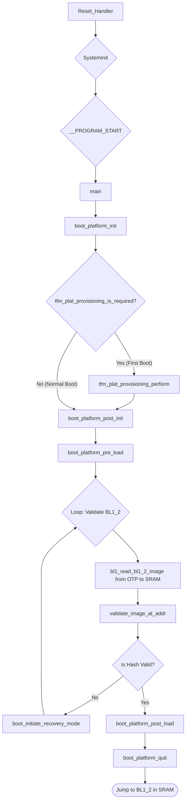

# Technical Report: TF-M BL1_1 Boot Stage Analysis for Corstone-1000

This report provides a detailed technical analysis of the Trusted Firmware-M (TF-M) BL1_1 boot stage, specifically for the `arm/corstone1000` FVP platform. It traces the code execution from the initial reset vector to the final handoff to the BL1_2 stage.

## 1. Executive Summary & High-Level Role

**BL1_1 is the first stage of the TF-M secure boot process and acts as the immutable Root of Trust (RoT) for the system.** Its primary responsibilities are to perform minimal, critical hardware initialization and to verify the integrity of the next boot stage, BL1_2, before passing execution control.

*   **Storage and Immutability:** The BL1_1 code is stored in a non-volatile, read-only memory (ROM), which is typically a region of the main flash memory that is permanently write-protected after manufacturing. On the Corstone-1000 platform, this corresponds to the beginning of the flash memory at address `0x68000000`. This immutability is the foundation of the system's chain of trust.

*   **Execution Model:** BL1_1 executes **In-Place (XIP)** directly from ROM. While its read-write data (`.data`, `.bss`) is loaded into and accessed from SRAM, the code instructions themselves are fetched from flash, minimizing the SRAM footprint and reducing the attack surface.

*   **Dual Role:** BL1_1 has a dual role depending on the device's lifecycle state (LCS):
    1.  **First Boot (Provisioning):** When the device is in a manufacturing or provisioning state (e.g., `ASSEMBLY_AND_TEST` LCS), BL1_1 is responsible for reading a **provisioning bundle** from a predefined location in flash and permanently writing its contents—including keys, certificates, and the BL1_2 image itself—into the secure One-Time Programmable (OTP) memory.
    2.  **Normal Boot:** On all subsequent boots, BL1_1 skips the provisioning step. It retrieves the hash of the BL1_2 image from OTP, copies the BL1_2 image from OTP to SRAM, computes its hash, and verifies that the computed hash matches the one stored in OTP.

## 2. Execution Flow Diagram

The following flowchart illustrates the main execution path of BL1_1.



## 3. Detailed Code Trace and Key Function Analysis

The execution of BL1_1 begins at the hardware reset vector and proceeds through several stages of initialization and verification.

### Code Trace from Reset

1.  **`Reset_Handler` (`platform/ext/target/arm/corstone1000/Device/Source/startup_corstone1000.c`)**
    *   This function is the initial entry point for the CPU, as defined in the vector table.
    *   It first calls `SystemInit()`, a standard CMSIS function that performs very low-level hardware setup (e.g., basic clock configuration).
    *   It then calls `__PROGRAM_START()`, which is the C library entry point. This function initializes the C runtime environment (e.g., setting up the stack, initializing global variables) and finally calls the `main()` function.

2.  **`main()` (`bl1/bl1_1/main.c`)**
    *   This is the main C function for BL1_1. It orchestrates the entire boot process by calling a series of platform-abstracted functions.
    *   It first calls `boot_platform_init()` to set up critical hardware like the MPU and firewalls.
    *   It then checks if provisioning is required via `tfm_plat_provisioning_is_required()`. If so, it performs the provisioning with `tfm_plat_provisioning_perform()`.
    *   It enters a `do-while` loop to load and validate the BL1_2 image. This loop allows for recovery attempts if validation fails.
    *   Once BL1_2 is successfully validated, it calls `boot_platform_quit()` to hand over execution.

### Key Function Analysis

#### Chain of Trust Verification

The verification of the BL1_2 image is performed by the `validate_image_at_addr` function in `bl1/bl1_1/main.c`. This function is the cornerstone of the chain of trust.

1.  **Load BL1_2 to SRAM:** The `bl1_read_bl1_2_image` function is called to copy the BL1_2 image from its storage location (OTP in a provisioned device) into its execution location in SRAM (`BL1_2_CODE_START`, defined as `0x30008000`).
2.  **Compute Hash:** `bl1_sha256_compute` is called to calculate the SHA-256 hash of the BL1_2 image now residing in SRAM.
3.  **Retrieve Stored Hash:** `tfm_plat_otp_read` is called to read the trusted hash of BL1_2 from OTP. The specific OTP slot used is `PLAT_OTP_ID_BL1_2_IMAGE_HASH`. This hash was placed in OTP during the initial provisioning.
4.  **Compare Hashes:** `bl_fih_memeql` performs a constant-time comparison between the computed hash and the hash retrieved from OTP. A constant-time comparison is used to mitigate side-channel attacks. If the hashes match, the image is considered authentic and the boot process continues.

#### Non-Security Functions (Hardware Initialization)

The `boot_platform_init` function in `platform/ext/target/arm/corstone1000/bl1/boot_hal_bl1_1.c` performs the minimal set of hardware initializations. For Corstone-1000, these are heavily focused on security.

*   **Watchdog:** `corstone1000_watchdog_init()` initializes the watchdog timer to ensure the system can recover from hangs.
*   **MPU (Memory Protection Unit):** `setup_mpu()` configures the MPU to define memory regions and their access permissions, preventing unauthorized memory access.
*   **Firewalls:** `setup_se_firewall()` and `setup_host_firewall()` configure the extensive hardware firewalls in the Corstone-1000 SoC. These firewalls isolate the Secure Enclave and control access to all peripherals and memory regions, forming a critical part of the system's security architecture.
*   **Crypto Accelerator:** `cc3xx_lowlevel_init()` initializes the CC312 crypto accelerator, making it available for cryptographic operations like hashing.
*   **UART:** `stdio_init()` initializes the UART for logging purposes, which is typically enabled only in debug builds.

The functional scope of BL1_1 is therefore not just non-security initializations; its primary role is to establish a secure state by configuring the system's hardware security features before any other firmware runs.

#### Execution Handoff

The `boot_platform_quit` function in `platform/ext/target/arm/corstone1000/bl1/boot_hal_bl1_1.c` manages the final handoff to BL1_2.

1.  It resets the watchdog timer.
2.  It retrieves the initial Main Stack Pointer (MSP) and the Reset Handler address from the BL1_2 vector table, which is located at the start of the BL1_2 image in SRAM.
3.  It sets the MSP to the value provided by BL1_2.
4.  It calls `boot_jump_to_next_image()`, an assembly function that performs an unconditional branch to the BL1_2 Reset Handler, thus transferring execution control.

## 4. Key Data Structures and Security Mechanisms

### Data Structures

The most important data structure in the BL1_1 stage is the **provisioning bundle**, defined by the `bl1_assembly_and_test_provisioning_data_t` struct in `platform/ext/target/arm/corstone1000/bl1/provisioning.c`.

```c
__PACKED_STRUCT bl1_assembly_and_test_provisioning_data_t {
    uint32_t magic;
    uint8_t bl2_encryption_key[32];
    uint8_t guk[32];
    uint8_t bl1_2_image_hash[32];
    uint8_t bl2_image_hash[32];
    uint8_t bl1_2_image[BL1_2_CODE_SIZE];
    uint8_t bl1_2_image_len[4];
    uint8_t bl1_rotpk_0[56];
};
```
This structure is not created by BL1_1 but is consumed by it during the first boot. It is placed at a specific address in flash (`PROVISIONING_DATA_START`) and contains all the secrets and images needed to initialize the device, including the BL1_2 image and its hash.

### Security Hardening

*   **Immutable Root of Trust:** The integrity of BL1_1 itself is guaranteed by residing in a write-protected ROM region.
*   **Fault Injection (FI) Countermeasures:** The code makes extensive use of a Fault Injection Hardening (FIH) library to protect against physical attacks.
    *   **Redundant Data Types:** It uses a special data type, `fih_int`, which stores values in a redundant format to detect corruption.
    *   **Resilient Function Calls:** Critical functions are wrapped with `FIH_CALL`, which includes logic to verify the integrity of the return value.
    *   **Secure Panic State:** If a fault is detected, the system enters a secure halt state via `FIH_PANIC`.
    *   **Constant-Time Operations:** The hash comparison is performed using `bl_fih_memeql`, a constant-time memory comparison function that helps prevent both timing and fault-based side-channel attacks.

## 5. Platform Integration and Tooling

### HAL (Hardware Abstraction Layer)

Porting BL1_1 to a new platform requires implementing a set of HAL functions. For the Corstone-1000 platform, the key HAL functions are:

*   **`tfm_plat_otp_read(id, ...)` / `tfm_plat_otp_write(id, ...)`:** Functions to read from and write to the hardware OTP. The `id` corresponds to the `tfm_otp_element_id_t` enum.
*   **`tfm_plat_provisioning_is_required()`:** Checks a platform-specific indicator (the LCS in OTP) to determine if provisioning is needed.
*   **`tfm_plat_provisioning_perform()`:** Implements the platform-specific provisioning sequence.
*   **`boot_platform_init()`:** Contains the platform-specific hardware initialization sequence (MPU, firewalls, etc.).
*   **`boot_platform_quit()`:** Implements the platform-specific mechanism for jumping to the next boot stage.

### Associated Tooling

The TF-M build system relies on several Python scripts to prepare the firmware images. For BL1_1, the most relevant script is:

*   **`create_provisioning_bundle.py` (`bl1/bl1_1/scripts/`)**: This script takes the individual assets for provisioning (such as keys, the BL1_2 image binary, and other configuration data) and assembles them into the `bl1_assembly_and_test_provisioning_data_t` binary format. The output of this script is the provisioning bundle that is included in the final flash image for use on the first boot.

