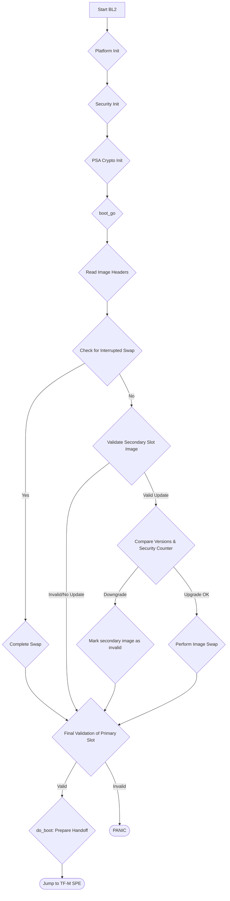

# Technical Report: TF-M BL2 (MCUboot) Analysis for Corstone-1000 MPS3

## 1. Executive Summary & High-Level Role

This report provides a detailed code-level analysis of the TF-M BL2 boot stage, which is implemented by MCUboot, specifically for the Arm Corstone-1000 platform running on MPS3 FPGA hardware.

The precise role of the BL2 stage is to act as a **second-stage, updatable bootloader**. Its primary responsibilities are:
1.  **Establish a Chain of Trust**: To cryptographically verify the authenticity and integrity of the next-stage firmware, which is the TF-M Secure Processing Environment (SPE) runtime and associated Non-Secure Processing Environment (NSPE) images.
2.  **Firmware Update**: To securely apply firmware updates, swapping a new, validated image from a secondary slot into the primary slot for execution.
3.  **Anti-Rollback Protection**: To prevent the device from booting older, potentially vulnerable firmware versions by enforcing a monotonically increasing security counter.
4.  **Execution Handoff**: To prepare the hardware and securely transfer execution control to the verified TF-M runtime.

The BL2 code, along with the firmware images it manages, is stored in a **32MB external NOR Flash** (typically a PMOD SF3 module on the MPS3 board). It is loaded and executed by a preceding, immutable boot stage (BL1 or a platform-specific ROM), which is responsible for basic hardware initialization and establishing the initial root of trust. A separate **8MB Secure Flash** is used to store sensitive data, including Protected Storage (PS), Internal Trusted Storage (ITS), and the Non-Volatile (NV) security counters.

## 2. Execution Flow Diagram

The following Mermaid flowchart illustrates the main execution path of the BL2 bootloader on the Corstone-1000 platform.



## 3. Detailed Code Trace and Key Function Analysis

The entry point for BL2 is the `main()` function located in `bl2/ext/mcuboot/bl2_main.c`. The execution flow is as follows:

1.  **Initialization**:
    *   `mbedtls_memory_buffer_alloc_init()`: Sets up a static memory pool for the Mbed TLS crypto library.
    *   `boot_platform_init()`: This HAL function (in `platform/ext/target/arm/corstone1000/bl2/boot_hal_bl2.c`) performs critical platform-specific setup. It initializes the watchdog timer, the flash driver (`Driver_FLASH0`), and most importantly, parses the **GUID Partition Table (GPT)** to discover the location and size of all firmware partitions. This information is used to populate MCUboot's internal `flash_map`.
    *   `boot_nv_security_counter_init()`: Initializes the non-volatile counter system.
    *   `psa_crypto_init()`: Initializes the PSA Cryptography API subsystem.

2.  **Image Processing**:
    *   The `main` function calls `boot_go_for_image_id()` for each image it needs to manage (typically the host FIP and then the TF-M SPE).
    *   This calls `context_boot_go()` in `boot/bootutil/src/loader.c`, which orchestrates the core logic:
        *   It determines if an update is pending by checking the trailer of the primary slot for a `BOOT_SWAP_TYPE_TEST` or `BOOT_SWAP_TYPE_PERM` flag.
        *   If an update is requested, it proceeds to the verification and swap phase.
        *   If no update is requested, it proceeds directly to validating the image in the primary slot.

3.  **Key Function Analysis**:

    *   **Chain of Trust Verification (`bootutil_img_validate`)**:
        This function, located in `boot/bootutil/src/image_validate.c`, is the heart of the security verification.
        *   **Purpose**: To verify the integrity and authenticity of a firmware image.
        *   **Implementation**:
            1.  It first computes a **SHA-256 hash** of the `image_header`, the image payload, and the protected TLV area.
            2.  It iterates through the image's TLVs. It finds the `IMAGE_TLV_SHA256` TLV and confirms that its content matches the hash just computed.
            3.  It finds the `IMAGE_TLV_KEYHASH` TLV, which contains the hash of the public key. It compares this against the hashes of the public keys embedded in the BL2 firmware to find the correct key to use (`bootutil_find_key`).
            4.  It finds the signature TLV (e.g., `IMAGE_TLV_RSA2048_PSS`).
            5.  It calls `bootutil_verify_sig`, which uses the Mbed TLS backend to perform an RSA PSS signature verification on the image hash using the selected public key.
            6.  It finds the `IMAGE_TLV_SEC_CNT` TLV and verifies it against the hardware NV counter.

    *   **Secure Firmware Update (`swap_run`)**:
        The Corstone-1000 does not use a scratch partition; it uses the `swap_move` strategy implemented in `boot/bootutil/src/swap_move.c`.
        *   **Purpose**: To safely swap the new image from the secondary slot into the primary slot.
        *   **Implementation**: The process is designed to be power-fail-safe by writing status updates to the flash trailer at each step.
            1.  **Move Up**: The existing image in the primary slot is shifted "up" by one sector, freeing the first sector to be used as a temporary buffer. This is done by copying sector `i` to sector `i+1`, starting from the end of the image.
            2.  **Swap**: A three-way swap is performed for each sector. The new sector from the secondary slot is moved to the primary slot, and the old sector from the primary slot is moved to the secondary slot, using the freed first sector as temporary storage.

    *   **Execution Handoff (`boot_platform_quit`)**:
        This function, located in `platform/ext/target/arm/corstone1000/bl2/boot_hal_bl2.c`, performs the final jump.
        *   **Purpose**: To transfer control to the verified TF-M SPE image.
        *   **Implementation**: It sets the Main Stack Pointer (MSP) to the value found in the SPE image's vector table (`vt->msp`) and then performs an unconditional branch to the image's Reset Handler address (`vt->reset`).

## 4. Key Data Structures and Security Mechanisms

*   **Data Structures**:
    *   **`struct image_header`**: A 32-byte structure at the start of every image, defined in `bootutil/image.h`. It contains a magic number, image size, version (`struct image_version`), and flags. A key field is `ih_protect_tlv_size`, which specifies the size of the protected metadata that is included in the signature's hash.
    *   **TLV Area**: A flexible area at the end of the image for metadata. Key TLVs include:
        *   `IMAGE_TLV_SHA256`: The hash of the image and its protected metadata.
        *   `IMAGE_TLV_KEYHASH`: The hash of the public key used for verification.
        *   `IMAGE_TLV_RSA2048_PSS`: The RSA signature.
        *   `IMAGE_TLV_SEC_CNT`: The security counter for anti-rollback.

*   **Security Hardening**:
    *   **Anti-Rollback Protection**: This is implemented via a combination of the `IMAGE_TLV_SEC_CNT` in the image manifest and a non-volatile counter on the platform. The platform-specific implementation is in `platform/ext/target/arm/corstone1000/bl2/security_cnt_bl2.c`.
        *   During validation, `bootutil_img_validate` reads the security counter from the image TLV.
        *   It calls `boot_nv_security_counter_get`, which in turn calls `tfm_plat_read_nv_counter` to read the value from the secure flash.
        *   The image is rejected if its counter is less than the stored value.
        *   To update the counter, BL2 calls `boot_nv_security_counter_update`, which **stages** the new value by calling `fwu_stage_nv_counter`. A later boot stage (U-Boot) is responsible for committing this staged value to the hardware counter, providing a robust, multi-stage update process.
    *   **Physical Attack Countermeasures**: The code makes use of a Fault Injection Hardening (FIH) library (`fih.h`). Security-critical comparisons (like `memcmp` or checking return codes) are wrapped in FIH macros. This makes it more difficult for an attacker to bypass a check by inducing a temporary fault (e.g., a voltage glitch).
        *   **Example from `image_validate.c`:**
            ```c
            /* Instead of: if (memcmp(hash, buf, sizeof(hash)) != 0) */
            FIH_CALL(boot_fih_memequal, fih_rc, hash, buf, sizeof(hash));
            if (FIH_NOT_EQ(fih_rc, FIH_SUCCESS)) {
                FIH_SET(fih_rc, FIH_FAILURE);
                goto out;
            }
            ```

## 5. Platform Integration and Tooling

*   **HAL (Hardware Abstraction Layer)**:
    *   **Flash**: The `ARM_DRIVER_FLASH` CMSIS API is used for all flash operations. `Driver_FLASH0` is used for the main firmware flash (PMOD SF3), and `Driver_FLASH1` for the secure flash (SST26VF064B) containing ITS/PS/NV counters.
    *   **SD Card Interaction**: Firmware updates are typically delivered via an SD card. The `plat_io_storage_init()` function in `boot_hal_bl2.c` initializes the storage backend. On Corstone-1000, this does not mean BL2 directly reads the SD card. Instead, a prior boot stage (like U-Boot) uses this storage backend to read the new firmware image from the card and write it to the secondary slot in the NOR flash. BL2's role is to then process the image from that secondary slot.
    *   **NV Counter**: The API is defined in `tfm_plat_nv_counters.h`, with key functions being `tfm_plat_read_nv_counter` and `tfm_plat_set_nv_counter`, which interact with the secure flash.

*   **Associated Tooling**:
    *   The primary tool used to create and sign firmware images is **`imgtool.py`**, located in the `mcuboot/scripts` directory.
    *   **Example Usage:**
        ```bash
        python3 imgtool.py sign \
            --key my_private_key.pem \
            --header-size 0x400 \
            --align 8 \
            --version 1.2.3 \
            --security-counter 4 \
            --pad-header \
            -S 0x50000 \
            my_app.bin my_app_signed.bin
        ```
        This command signs the `my_app.bin` binary, adding a header, version information, and a security counter, and outputs the signed image to `my_app_signed.bin`. The `-S` argument specifies the maximum application size, and `--header-size` specifies the offset at which the application binary starts.
