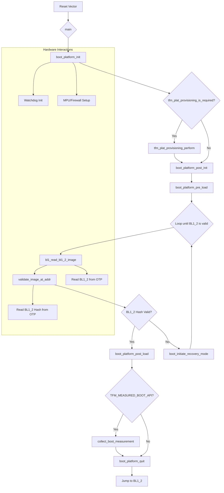

# Technical Report: TF-M BL1_1 Boot Stage on Corstone-1000 MPS3

## 1. Executive Summary & High-Level Role

The TF-M BL1_1 boot stage is the initial and immutable root of trust in the secure boot process for the Arm Corstone-1000 platform. Its primary role is to establish a secure foundation for the system by verifying the integrity and authenticity of the next boot stage, BL1_2, before handing over execution.

*   **Immutability and Storage**: The BL1_1 code is stored in a secure, one-time programmable (OTP) memory region within the CC312 crypto co-processor. This makes it immutable, as the OTP memory cannot be modified after it has been provisioned. This immutability is the cornerstone of the hardware root of trust.

*   **Execution-in-Place (XIP)**: BL1_1 is designed to execute directly from its storage location in OTP memory. This is a critical security feature, as it eliminates the need to copy the code to another memory location (like RAM) before execution, which could potentially expose it to tampering.

*   **Minimalism**: BL1_1 is intentionally minimal in its functionality. It performs only the essential tasks required to verify and launch the next boot stage. This minimalistic design reduces the attack surface and minimizes the possibility of vulnerabilities in this critical part of the boot process.

In essence, BL1_1 acts as the first verifier in a chain of trust. It is the most trusted piece of code in the system, and its security guarantees are foundational to the security of the entire platform.

## 2. Execution Flow Diagram



## 3. Detailed Code Trace and Key Function Analysis

The execution of BL1_1 begins at the `Reset_Handler`, which is the default entry point for an Arm Cortex-M processor after a reset.

### `Reset_Handler` (in `startup_corstone1000.c`)

The `Reset_Handler` is responsible for basic CPU and memory initialization. For the Corstone-1000, it performs the following key actions:

1.  **Initializes the stack pointer**: Sets up the initial value of the Main Stack Pointer (MSP).
2.  **Initializes the C library**: The handler calls `__libc_init_array` to initialize the C standard library.
3.  **Jumps to `main`**: After basic initialization, the `Reset_Handler` jumps to the `main` function in `bl1/bl1_1/main.c`.

### `main` (in `bl1/bl1_1/main.c`)

The `main` function orchestrates the entire BL1_1 boot process.

```c
int main(void)
{
    // ...
    boot_platform_init();
    // ...
    if (tfm_plat_provisioning_is_required()) {
        tfm_plat_provisioning_perform();
    }
    // ...
    do {
        bl1_read_bl1_2_image((uint8_t *)BL1_2_CODE_START);
        validate_image_at_addr((uint8_t *)BL1_2_CODE_START);
        // ...
    } while (fih_not_eq(fih_rc, FIH_SUCCESS));
    // ...
    boot_platform_quit((struct boot_arm_vector_table *)BL1_2_CODE_START);
    // ...
}
```

### Key Function Analysis

*   **`boot_platform_init()`** (in `platform/ext/target/arm/corstone1000/bl1/boot_hal_bl1_1.c`):
    *   **Purpose**: To perform the absolute minimum hardware initialization required for the BL1_1 stage to function.
    *   **Actions**:
        *   Initializes the watchdog timer to prevent unintended resets.
        *   Configures the Memory Protection Unit (MPU) to set up basic memory access permissions.
        *   Configures the SE and Host firewalls to control access to peripherals and memory regions. This is a critical step in establishing the security of the system.
        *   Initializes the UART for logging purposes.
        *   Initializes the CC312 crypto accelerator.

*   **`tfm_plat_provisioning_is_required()`** and **`tfm_plat_provisioning_perform()`** (in `platform/ext/target/arm/corstone1000/bl1/provisioning.c`):
    *   **Purpose**: To provision the device with essential cryptographic keys and other data on the first boot.
    *   **Actions**:
        *   `tfm_plat_provisioning_is_required` reads the Lifecycle State (LCS) from OTP to determine if provisioning is needed.
        *   `tfm_plat_provisioning_perform` writes the provisioning bundle (containing keys, hashes, and the BL1_2 image) to the OTP memory.

*   **`bl1_read_bl1_2_image()`** (in `bl1/bl1_1/lib/image_otp.c`):
    *   **Purpose**: To read the BL1_2 image from OTP into SRAM.
    *   **Actions**:
        *   Calls `tfm_plat_otp_read` to first read the length of the BL1_2 image.
        *   Calls `tfm_plat_otp_read` again to read the entire BL1_2 image into the location specified by `BL1_2_CODE_START`.

*   **`validate_image_at_addr()`** (in `bl1/bl1_1/main.c`):
    *   **Purpose**: To verify the integrity and authenticity of the BL1_2 image.
    *   **Actions**:
        *   **Compute Hash**: It computes the SHA-256 hash of the BL1_2 image that was copied into SRAM.
        *   **Read Stored Hash**: It reads the expected hash of the BL1_2 image from OTP using `tfm_plat_otp_read`.
        *   **Compare Hashes**: It performs a constant-time memory comparison (`bl_fih_memeql`) of the computed hash and the stored hash. If they match, the image is considered valid.

*   **`boot_platform_quit()`** (in `platform/ext/target/arm/corstone1000/bl1/boot_hal_bl1_1.c`):
    *   **Purpose**: To hand over execution to the BL1_2 stage.
    *   **Actions**:
        *   Resets the watchdog timer.
        *   Sets the Main Stack Pointer (MSP) to the value specified in the BL1_2 vector table.
        *   Jumps to the BL1_2 `Reset_Handler`.

## 4. Chain of Trust Verification

The chain of trust is established by a series of cryptographic verifications, where each stage of the boot process verifies the next. BL1_1, as the root of trust, initiates this chain by verifying the BL1_2 image.

The verification mechanism is based on a hash comparison:

1.  **Hash Computation**: BL1_1 computes a SHA-256 hash of the BL1_2 image after it has been loaded into SRAM. This is done by the `bl1_sha256_compute` function.

2.  **Secure Storage of the Expected Hash**: The expected hash of the BL1_2 image is securely stored in the CC312's OTP memory. This value is written to the OTP during the one-time provisioning process of the device. The `plat_otp_layout_t` struct in `otp_cc312.c` defines the exact location of this hash within the OTP memory map (`bl1_2_image_hash` field).

3.  **Hash Retrieval**: The `validate_image_at_addr` function calls `tfm_plat_otp_read` with the `PLAT_OTP_ID_BL1_2_IMAGE_HASH` identifier to retrieve the stored hash from OTP.

4.  **Comparison**: The computed hash is then compared to the hash retrieved from OTP using a constant-time memory comparison function (`bl_fih_memeql`). This is a security measure to prevent timing attacks that could potentially leak information about the hash.

If the computed hash and the stored hash match, the BL1_2 image is considered authentic and the boot process continues. Otherwise, the device enters a recovery mode.

## 5. Non-Security Functions (Hardware Initialization)

BL1_1 performs a minimal set of hardware initializations that are essential for its operation. These are primarily handled by the `boot_platform_init` function. For the Corstone-1000 MPS3 platform, this includes:

*   **Watchdog Initialization**: The watchdog timer is initialized and started early in the boot process. This is a critical non-security function that ensures the system can recover from a hung state. The watchdog is reset at the end of the BL1_1 stage before jumping to BL1_2.

*   **MPU and Firewall Configuration**: While these are security features, their initialization is a fundamental part of the hardware setup. BL1_1 configures the MPU and the SE/Host firewalls to establish the necessary memory and peripheral access controls for the boot process.

*   **UART Initialization**: The UART is initialized to provide logging output. This is a non-essential function for the boot process itself, but it is critical for debugging and development. It is enabled by default in debug builds.

*   **Crypto Accelerator Initialization**: The CC312 crypto accelerator is initialized to be used for the hash computation.

BL1_1 does **not** perform complex initializations like setting up memory controllers for external DRAM or configuring the full clock tree. Its scope is limited to the bare minimum required to verify and launch the next boot stage.

## 6. Execution Handoff

After the BL1_2 image has been successfully verified, the `boot_platform_quit` function (located in `platform/ext/target/arm/corstone1000/bl1/boot_hal_bl1_1.c`) is responsible for handing over execution to the BL1_2 stage.

This function performs the following steps:

1.  **Resets the watchdog timer**: This is to prevent a watchdog reset during the handoff process.
2.  **Sets the Main Stack Pointer (MSP)**: It retrieves the initial stack pointer value from the BL1_2 vector table (which is located at the beginning of the BL1_2 image in SRAM) and sets the MSP to this value.
3.  **Jumps to the BL1_2 Reset Handler**: It retrieves the address of the BL1_2 `Reset_Handler` from the vector table and performs an unconditional jump to that address.

This carefully managed handoff ensures that BL1_2 starts its execution in a well-defined and secure state.

## 7. Key Data Structures and Security Mechanisms

### Data Structures

The most important data structure in the BL1_1 stage is the provisioning bundle, which is defined by the `bl1_assembly_and_test_provisioning_data_t` struct in `platform/ext/target/arm/corstone1000/bl1/provisioning.c`.

```c
__PACKED_STRUCT bl1_assembly_and_test_provisioning_data_t {
    uint32_t magic;
    uint8_t bl2_encryption_key[32];
    uint8_t guk[32];
    uint8_t bl1_2_image_hash[32];
    uint8_t bl2_image_hash[32];
    uint8_t bl1_2_image[BL1_2_CODE_SIZE];
    uint8_t bl1_2_image_len[4];
    uint8_t bl1_rotpk_0[56];
};
```

This structure contains all the essential data that is provisioned into the device's OTP memory during the first boot. This includes cryptographic keys, image hashes, and the BL1_2 image itself.

### Security Hardening

The integrity of the BL1_1 stage itself is guaranteed by its storage in immutable OTP memory. Once the BL1_1 code is written to OTP, it cannot be modified.

In addition to this fundamental security measure, the BL1_1 code also implements countermeasures against physical attacks:

*   **Fault Injection (FI) Hardening**: The code makes extensive use of the `fih.h` library, which provides macros and functions to harden the code against fault injection attacks. This includes techniques like duplicating critical variables and performing redundant checks to ensure that a transient fault does not compromise the boot process. For example, `fih_int` is a custom integer type that stores a value and its inverse, and operations on it check for consistency.

*   **Constant-Time Operations**: Cryptographic operations, such as the comparison of the BL1_2 hash, are performed using constant-time functions (`bl_fih_memeql`). This prevents timing side-channel attacks that could potentially leak information about the secret values being compared.

## 8. Platform Integration and Tooling

### HAL (Hardware Abstraction Layer)

Porting BL1_1 to a new platform requires implementing a set of Hardware Abstraction Layer (HAL) functions. For the Corstone-1000 MPS3 platform, the key HAL functions are:

*   **`boot_platform_init()`**: Performs platform-specific hardware initialization.
*   **`boot_platform_quit()`**: Handles the handoff to the next boot stage.
*   **`tfm_plat_otp_read()`**: Reads data from the platform's OTP memory.
*   **`tfm_plat_otp_write()`**: Writes data to the platform's OTP memory.
*   **`tfm_plat_provisioning_is_required()`**: Checks if the device requires provisioning.
*   **`tfm_plat_provisioning_perform()`**: Performs the provisioning process.

The implementations of these functions for the Corstone-1000 are found in `boot_hal_bl1_1.c`, `provisioning.c`, and `otp_cc312.c`.

### Associated Tooling

The build process for the Corstone-1000 platform uses CMake to generate the final BL1_1 image. A key part of this process is the generation of the provisioning bundle.

*   **`create_provisioning_bundle.py`**: This Python script is used to create the `bl1_provisioning_bundle.bin` file. It takes the BL2 encryption key, the GUK, the hashes of the BL1_2 and BL2 images, and the BL1_2 image itself as input, and combines them into a single binary file in the format expected by the `provision_assembly_and_test` function. This bundle is then programmed into the device's flash memory at the `PROVISIONING_DATA_START` address.

