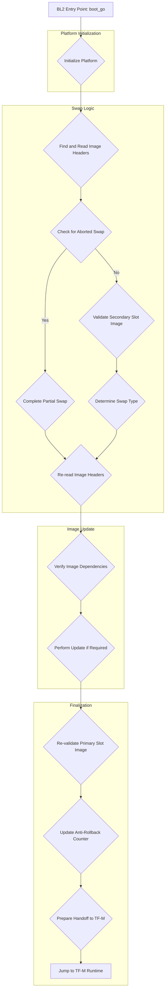

# Technical Report: TF-M BL2 (MCUboot) Analysis for Corstone-1000 FVP

## 1. Executive Summary & High-Level Role

This report provides a detailed technical analysis of the Trusted Firmware-M (TF-M) BL2 boot stage, which is implemented by MCUboot, specifically for the Arm Corstone-1000 FVP platform. The objective is to provide a code-level understanding of the complete execution flow, from initialization to the handoff to the TF-M runtime.

The precise role of the BL2 stage in the TF-M secure boot process is to act as a second-stage, updatable bootloader. Its primary responsibilities are:

1.  **Firmware Authentication**: To verify the authenticity and integrity of the TF-M runtime image (and other images, such as TF-A) before execution. This is achieved by verifying the image's digital signature.
2.  **Firmware Update**: To provide a secure mechanism for updating the firmware. This includes identifying a new firmware image, validating it, and installing it.
3.  **Anti-Rollback Protection**: To prevent the device from booting with an older, potentially vulnerable version of the firmware.

The BL2 code is stored in a dedicated region of the flash memory. It is loaded and executed by the preceding stage, BL1, which is a small, immutable, first-stage bootloader stored in ROM or a protected flash region. BL1 performs a basic integrity check on BL2 before handing over control. On the Corstone-1000 platform, the exact location of BL2 in flash is determined at runtime by parsing the GUID Partition Table (GPT) stored on the flash device.

## 2. Execution Flow Diagram

## 3. Detailed Code Trace and Key Function Analysis

The execution of BL2 (MCUboot) on the Corstone-1000 FVP platform begins with the `boot_go` function, which serves as the main entry point. The core logic is orchestrated by the `context_boot_go` function, which adapts its behavior based on the chosen boot strategy (e.g., direct-XIP, RAM load, or swap-based update). For the Corstone-1000 FVP, the default and most common strategy is the swap-based update, which this trace will focus on.

The execution flow can be broken down into the following steps:

1.  **Platform Initialization**:
    *   The `boot_platform_init` function in `bl2/boot_hal_bl2.c` is called.
    *   It initializes the watchdog timer (`corstone1000_watchdog_init`), the flash driver (`FLASH_DEV_NAME.Initialize`), and the partitioning system by parsing the GPT (`partition_init`).
    *   Crucially, it calls `bl2_get_boot_bank` to determine which set of firmware images to boot (A or B).
    *   It then dynamically populates the `flash_map` array by calling `fill_flash_map_with_tfm_data` and `fill_flash_map_with_fip_data`. These functions read the partition table to find the exact location of the TF-M and TF-A images, respectively.

2.  **Swap Status Check**:
    *   The `boot_prepare_image_for_update` function is called.
    *   It reads the image headers from the primary and secondary slots using `boot_read_image_headers`.
    *   It then checks for an aborted swap operation by reading the swap status from the flash trailer using `swap_read_status`. If an aborted swap is detected, `boot_complete_partial_swap` is called to finish the operation.

3.  **Update Candidate Validation**:
    *   If no aborted swap is found, BL2 proceeds to check if a firmware update is pending. It calls `boot_validated_swap_type`, which in turn calls `boot_validate_slot` on the secondary slot.
    *   `boot_validate_slot` performs a comprehensive check of the image in the secondary slot:
        *   It verifies the image header's magic number and sanity checks the offsets and sizes.
        *   It then calls `boot_image_check` to validate the image's integrity and authenticity.

4.  **Chain of Trust Verification**:
    *   The `boot_image_check` function is responsible for verifying the chain of trust. It calls `bootutil_img_validate`.
    *   `bootutil_img_validate` is the core of the verification process. For the Corstone-1000, which uses RSA signatures, the call chain eventually leads to `image_rsa_check` in `boot/bootutil/src/image_rsa.c`.
    *   **Signature Algorithm**: The signature algorithm used is RSA-2048 or RSA-3072, with SHA-256 as the hashing algorithm.
    *   **Verification Process**:
        1.  `bootutil_img_validate` reads the image manifest, which contains the image metadata and a series of Type-Length-Value (TLV) entries.
        2.  It calculates the SHA-256 hash of the image payload.
        3.  It finds the public key hash TLV and compares it to the hash of the public key embedded in BL2. This ensures that the image was signed with a key from the correct authority.
        4.  It finds the signature TLV and uses the embedded public key to decrypt the signature, revealing the expected hash of the image.
        5.  It compares the calculated hash with the decrypted hash. If they match, the signature is valid.

5.  **Secure Firmware Update**:
    *   If the image in the secondary slot is valid and has a higher version number, `boot_perform_update` is called.
    *   For the swap-based strategy, `boot_swap_image` is called. This function performs the actual swap of the images in flash. It uses the scratch area as a temporary buffer to avoid data loss in case of a power failure during the swap.
    *   The swap process involves copying sectors from the primary and secondary slots to the scratch area and back, in a carefully orchestrated sequence to ensure that a bootable image is always available.
    *   After the swap is complete, the `copy_done` flag is set in the flash trailer.

6.  **Execution Handoff**:
    *   After all updates are performed and the image in the primary slot is validated, `fill_rsp` is called to populate the `boot_rsp` structure with the necessary information for booting, including the flash device ID, the offset of the image, and a pointer to the image header.
    *   The `boot_platform_quit` function is then called.
    *   This function is responsible for the final handoff to the TF-M SPE (Secure Processing Environment). It performs the following actions:
        1.  Uninitializes the flash driver.
        2.  Sets the Main Stack Pointer (MSP) to the value specified in the TF-M image's vector table.
        3.  Calls `boot_jump_to_next_image`, which is an assembly function that executes a branch instruction to the TF-M runtime's reset handler address, also obtained from the vector table. This completes the BL2 execution and starts the TF-M runtime.

## 4. Key Data Structures and Security Mechanisms

BL2 relies on several key data structures and security mechanisms to perform its function. These are defined in the image format and the platform's hardware capabilities.

**Data Structures: Image Manifest**

The core data structure that BL2 parses is the image manifest, which is appended to the binary image. It consists of a fixed-size header followed by a variable-size area of Type-Length-Value (TLV) entries.

*   **Image Header (`struct image_header`)**:
    *   Defined in `boot/bootutil/include/bootutil/image.h`.
    *   Contains essential information such as:
        *   `ih_magic`: A magic number to identify the image format (`IMAGE_MAGIC`).
        *   `ih_load_addr`: The address where the image should be loaded in memory (for RAM-load strategies).
        *   `ih_hdr_size`: The size of the header itself.
        *   `ih_img_size`: The size of the image payload.
        *   `ih_ver`: The image version (`struct image_version`), containing major, minor, revision, and build number.
        *   `ih_flags`: A bitfield of flags, indicating properties like whether the image is encrypted or RAM-loadable.

*   **TLV Area**:
    *   Follows the image header and contains a series of TLV entries.
    *   Each TLV has a type, a length, and a value.
    *   Key TLV types include:
        *   `IMAGE_TLV_KEYHASH`: The SHA-256 hash of the public key used to sign the image.
        *   `IMAGE_TLV_SHA256`: The SHA-256 hash of the image payload.
        *   `IMAGE_TLV_RSA2048_PSS`, `IMAGE_TLV_RSA3072_PSS`, `IMAGE_TLV_ECDSA256`: The digital signature of the image.
        *   `IMAGE_TLV_SEC_CNT`: The security counter value for anti-rollback protection.
        *   `IMAGE_TLV_DEPENDENCY`: Defines a dependency on another image, specifying the image ID and minimum version.

**Security Hardening**

BL2 on the Corstone-1000 platform implements several security hardening mechanisms:

*   **Anti-Rollback Protection**:
    *   This is implemented using a combination of the security counter in the image manifest and non-volatile (NV) counters on the platform.
    *   The `security_cnt_bl2.c` file provides the platform-specific implementation.
    *   **Process**:
        1.  When validating an image, BL2 reads the `IMAGE_TLV_SEC_CNT` from the manifest.
        2.  It then reads the current security counter value from the platform's NV counter using `boot_nv_security_counter_get`, which calls `tfm_plat_read_nv_counter`.
        3.  The image is considered valid only if its security counter is greater than or equal to the value stored in the NV counter.
        4.  After a successful update, BL2 updates the NV counter with the new image's security counter value. On the Corstone-1000, this is done by staging the update with the Firmware Update Agent (`fwu_stage_nv_counter`), which ensures the update is applied atomically by a later boot stage.

*   **Fault Injection Hardening (FIH)**:
    *   The code makes extensive use of the `fih.h` library to protect against fault injection attacks.
    *   This involves techniques like redundant checks, random delays, and careful comparison of critical values to make it harder for an attacker to bypass security checks by inducing faults. You can see this in the use of `fih_ret` and `FIH_DECLARE` macros throughout the code.

*   **Physical Attack Countermeasures**:
    *   While not explicitly detailed in the BL2 source code, the Corstone-1000 platform itself provides hardware-level countermeasures against physical attacks. The use of a secure element (like the CC312) for cryptographic operations and key storage helps protect against side-channel attacks and physical probing. The BL2 code leverages this by calling into the crypto hardware accelerator for signature verification.

## 5. Platform Integration and Tooling

BL2 (MCUboot) is designed to be portable, and its integration with a specific platform like the Corstone-1000 FVP is achieved through a well-defined Hardware Abstraction Layer (HAL) and associated tooling.

**HAL (Hardware Abstraction Layer)**

The platform-specific HAL for the Corstone-1000 is primarily located in `platform/ext/target/arm/corstone1000/bl2/`. Key HAL functions that BL2 relies on include:

*   **Flash Access (`Driver_Flash.c`)**:
    *   BL2 uses a CMSIS-compliant flash driver (`ARM_DRIVER_FLASH`) for all its flash operations.
    *   The implementation in `Driver_Flash.c` provides functions like `Initialize`, `Uninitialize`, `ReadData`, `ProgramData`, and `EraseSector`. These are the low-level functions that MCUboot's core logic uses to read image headers, copy image data during an update, and erase flash sectors.

*   **NV Counter Reads/Writes (`security_cnt_bl2.c`)**:
    *   `boot_nv_security_counter_get()`: This function reads the non-volatile security counter. It abstracts the platform-specific mechanism, which in this case is `tfm_plat_read_nv_counter`.
    *   `boot_nv_security_counter_update()`: This function updates the NV counter. As discussed earlier, for the Corstone-1000, this is implemented by staging the update with the `fwu_agent`, providing a layer of abstraction and security.

*   **Platform Initialization and Handoff (`boot_hal_bl2.c`)**:
    *   `boot_platform_init()`: This function provides a hook for platform-specific initialization at the start of BL2 execution. For the Corstone-1000, it initializes the watchdog, flash, and partitioning system.
    *   `boot_platform_quit()`: This function provides a hook for platform-specific actions before jumping to the next image. For the Corstone-1000, it uninitializes the flash driver and sets up the stack for the TF-M runtime.

**Associated Tooling**

The primary tool used to generate and sign the TF-M runtime images that BL2 consumes is `imgtool.py`.

*   **`imgtool.py`**:
    *   This Python script is part of the MCUboot project and can be found in `scripts/imgtool.py`.
    *   Its main functions are:
        *   **Image Signing**: It takes a binary image file and a private key (e.g., an RSA private key) and generates a digital signature.
        *   **Manifest Generation**: It creates the image manifest, including the header and the TLV area. It populates the manifest with the image version, security counter, and other metadata.
        *   **Image Assembly**: It combines the original binary, the header, and the TLVs into a single, signed image file that is ready to be flashed to the device.
    *   The output of `imgtool.py` is the `.bin` file that is written to the secondary slot for a firmware update. BL2 is specifically designed to parse and verify this image format.

