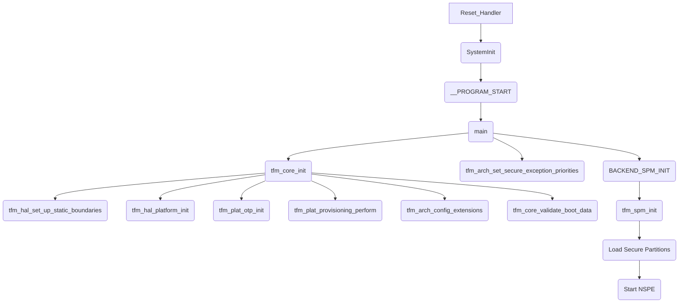

# Technical Report: TF-M Runtime Analysis for Arm Corstone-1000 FVP

## 1. Executive Summary & High-Level Role

The Trusted Firmware-M (TF-M) Runtime is the core of the Secure Processing Environment (SPE) in the Arm Corstone-1000 FVP platform. Its primary role is to provide a secure environment for the execution of trusted applications and services, isolated from the Non-Secure Processing Environment (NSPE). It enforces the security policies of the system, manages the lifecycle of secure partitions, and provides a standardized set of secure services to both the SPE and NSPE.

The TF-M runtime functions as a micro-kernel for the secure world. It is responsible for:

*   **Isolation:** Enforcing isolation between secure partitions and between the SPE and NSPE using the Arm TrustZone-M hardware security features, including the Secure Attribution Unit (SAU) and Memory Protection Unit (MPU).
*   **Communication:** Providing a secure and standardized Inter-Process Communication (IPC) mechanism for clients in the NSPE and SPE to access secure services.
*   **Scheduling:** Scheduling the execution of secure partitions.
*   **Services:** Providing a set of core secure services, including Crypto, Internal Trusted Storage (ITS), Protected Storage (PS), and Attestation.

The TF-M runtime code is loaded by the BL2 bootloader into the secure SRAM, which is located at address `0x30000000` on the Corstone-1000 FVP. Its execution begins at the `Reset_Handler` function, which is the entry point for the SPE firmware.

## 2. Execution Flow Diagram

The following Mermaid.js flowchart illustrates the main initialization flow of the TF-M Runtime:

## 3. Detailed Code Trace and Key Function Analysis

### SPM Initialization (spm_init)

The Secure Partition Manager (SPM) is initialized by the `tfm_spm_init` function, which is located in `secure_fw/spm/core/spm_ipc.c`. This function is responsible for setting up the entire secure runtime environment.

The initialization process is as follows:

1.  **Initialize Connection Pool:** The `spm_init_connection_space` function initializes the connection pool, which is used to manage client connections to secure services.
2.  **Initialize Lists:** The `UNI_LISI_INIT_NODE` macro initializes the partition and service lists.
3.  **Initialize NSPE Context:** The `tfm_nspm_ctx_init` function initializes the Non-Secure Partition Manager context.
4.  **Load Partitions:** The `tfm_spm_init` function enters a loop that iterates through the partition manifests and loads each partition. For each partition, it performs the following steps:
    *   **`load_a_partition_assuredly()`:** Loads the partition's manifest. The manifest is a C structure of type `partition_load_info_t`, which contains all the static information about the partition, such as its ID, priority, entry point, and resource requirements.
    *   **`load_services_assuredly()`:** Loads the services for the current partition.
    *   **`load_irqs_assuredly()`:** Loads the IRQs for the current partition.
    *   **`tfm_hal_bind_boundary()`:** Binds the partition to its hardware isolation boundary.
    *   **`backend_init_comp_assuredly()`:** Initializes the partition's runtime environment based on the backend (IPC or SFN).
5.  **Start System:** The `backend_system_run` function starts the scheduler and the NSPE.

### Hardware Isolation Setup

Hardware isolation is set up by the `tfm_hal_isolation.c` file in the `platform/ext/target/arm/corstone1000` directory. The following functions are responsible for configuring the SAU and MPU:

*   **`tfm_hal_set_up_static_boundaries()`:** This function is called at boot time to set up the initial, static memory protection. It configures the MPU with a default background region for the entire SRAM and then sets up specific regions for the secure data, application code, and metadata.
*   **`tfm_hal_bind_boundary()`:** This function is called for each secure partition during SPM initialization. It creates a "boundary handle" for the partition, which encodes its privilege level and other attributes.
*   **`tfm_hal_activate_boundary()`:** This function is called by the SPM when it needs to switch to a different partition. It reconfigures the MPU for the target partition based on its boundary handle.

### Secure Service Call Handling

A `psa_call` from the NSPE is handled by the following sequence of events:

1.  **Veneer:** The `psa_call` function is implemented as a veneer function, which is a small piece of code that acts as a bridge between the NSPE and the SPE. The veneer function is responsible for dispatching the call to the secure side via an `SVC` instruction.
2.  **SVC Handler:** The `SVC_Handler` in the SPE receives the `SVC` instruction and calls the appropriate SPM function to handle the request.
3.  **SPM:** The SPM receives the request and performs the following steps:
    *   It gets a free connection handle from the connection pool.
    *   It validates the input and output vectors and copies them into the connection handle.
    *   It dispatches the message to the target partition using the `backend_messaging` function.
4.  **IPC/SFN Model:** The `backend_messaging` function handles the message differently depending on the runtime model of the target partition:
    *   **SFN (Secure Function) Model:** The `psa_call` is essentially a direct function call to the secure service, with the SPM acting as a gatekeeper.
    *   **IPC (Inter-Process Communication) Model:** The SPM sends a message to the target partition and waits for a reply. The partition receives the message, processes it, and sends a reply back to the SPM.
5.  **Reply:** The SPM receives the reply from the service and returns it to the client.

### NSPE Handoff

The NSPE is started by the `backend_system_run` function in `secure_fw/spm/core/backend_sfn.c`. This function calls `tfm_hal_get_ns_entry_point` to get the entry point of the non-secure application and then calls `arch_clean_stack_and_launch` to perform the context switch to the non-secure world.

However, the implementation of `tfm_hal_get_ns_entry_point` in `platform/ext/target/arm/corstone1000/tfm_hal_platform.c` is incomplete in this version of the code. It simply returns 0. In a complete implementation, this function would typically read the NSPE entry point from the boot data passed by the bootloader.

## 4. Key Data Structures and Security Mechanisms

### Data Structures

*   **`partition_load_info_t`:** This structure is the "manifest" for a secure partition. It contains all the static information about a partition that the SPM needs to load and manage it.
*   **`service_load_info_t`:** This structure represents a secure service. It contains the service's ID, flags, version, and a pointer to the function that implements the service.
*   **`connection_t`:** This structure is used to manage client connections to secure services. It contains the connection handle, the service being accessed, the client that is accessing the service, and the message for the service.

### Security Hardening (Isolation Levels)

*   **Isolation Level 1:** All partitions run in privileged mode. The MPU is used to define the boundaries between the secure and non-secure worlds, but there is no MPU-based isolation between partitions.
*   **Isolation Level 2:** Partitions can run in either privileged or unprivileged mode. The MPU is used to enforce isolation between partitions. When the SPM switches between partitions, it reconfigures the MPU for the target partition.
*   **Isolation Level 3:** This level is similar to level 2, but it also provides isolation for the partition's private data.

## 5. Platform Integration and Tooling

### HAL (Hardware Abstraction Layer)

*   **`tfm_hal_platform_init()`:** Initializes the platform hardware.
*   **`tfm_hal_set_up_static_boundaries()`:** Sets up the initial static memory protection.
*   **`tfm_hal_bind_boundary()`:** Creates a boundary handle for a secure partition.
*   **`tfm_hal_activate_boundary()`:** Reconfigures the MPU for a target partition.
*   **`tfm_hal_get_ns_entry_point()`:** Gets the entry point of the non-secure application.

### Associated Tooling

The `tfm_parse_manifest_list.py` script is a Python script that parses the manifest files for each secure partition and generates the C data structures that are used by the SPM at runtime. This script makes it much easier to add new partitions and services to the system, as the developer only needs to create a manifest file and the script will take care of the rest.

